# Tutorial：Vibe Coding环境部署

# 介绍

本教程面向 Windows 用户，系统性地指导完成 **Vibe Coding（氛围编程）** 开发环境的完整搭建。Vibe Coding 是一种以 AI为核心驱动力的现代编程范式——开发者通过自然语言描述意图，由 AI助手完成代码生成、编辑与调试，从而将精力聚焦于设计思路而非实现细节。

教程分为两大阶段：

1. **基础依赖项安装** — 涵盖 Visual Studio Code（代码编辑器）、PowerShell 7（跨平台脚本终端）、Windows Terminal（现代化终端应用）、Node.js + pnpm（JavaScript 运行时与包管理器）、以及 Git（版本控制系统）。每一步均配有截图指引和验证方法，确保零基础用户也能顺利完成。
2. **AI 开发工具安装与配置** — 首先安装 Claude Code（Anthropic 推出的智能体编程工具）及其 VS Code 插件，获得终端 + IDE 双场景的 AI 编程能力；随后通过 CC Switch 工具配置第三方模型（如 DeepSeek-v4），实现一键切换 AI 服务商，摆脱对单一模型的依赖。

全教程以图文并茂的方式呈现，每节末尾附有验证步骤，方便读者随时自查安装是否成功。完成全部配置后，即可在 Windows 环境中流畅使用 AI 赋能的 Vibe Coding 工作流。

# 安装依赖项

## [Visual Studio Code](https://code.visualstudio.com/)

Visual Studio Code（简称 VS Code）是一款跨平台的代码编辑器，支持 Windows、macOS 和 Linux。

VS Code 运行十分轻快，对绝大多数硬件设备和操作系统版本都能完美兼容。

### 官方网站

### 安装步骤

1. 参考官方指南，或使用附件安装
  1. 如果有管理员权限，使用 **System Installer** `VSCodeSetup-x64-1.120.0.exe`
  2. 否则，使用 **User Installer** `VSCodeUserSetup-x64-1.120.0.exe`
2. 选择`我同意此协议`并点击`下一步`

3. 如果使用System Installer，有额外步骤

选择安装路径并点击`下一步`

点击`下一步`

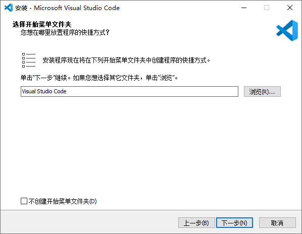

4. 按需选择附加任务并点击`下一步`

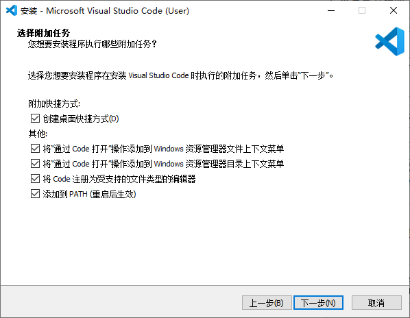

4. 点击`安装`

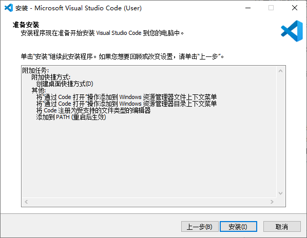

5. 等待安装完成，点击`完成`

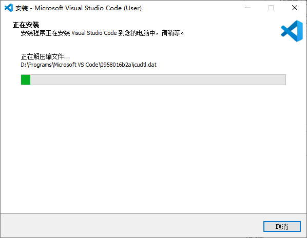

### 验证

1. 可以在开始菜单中找到应用

2. 打开后界面如下图

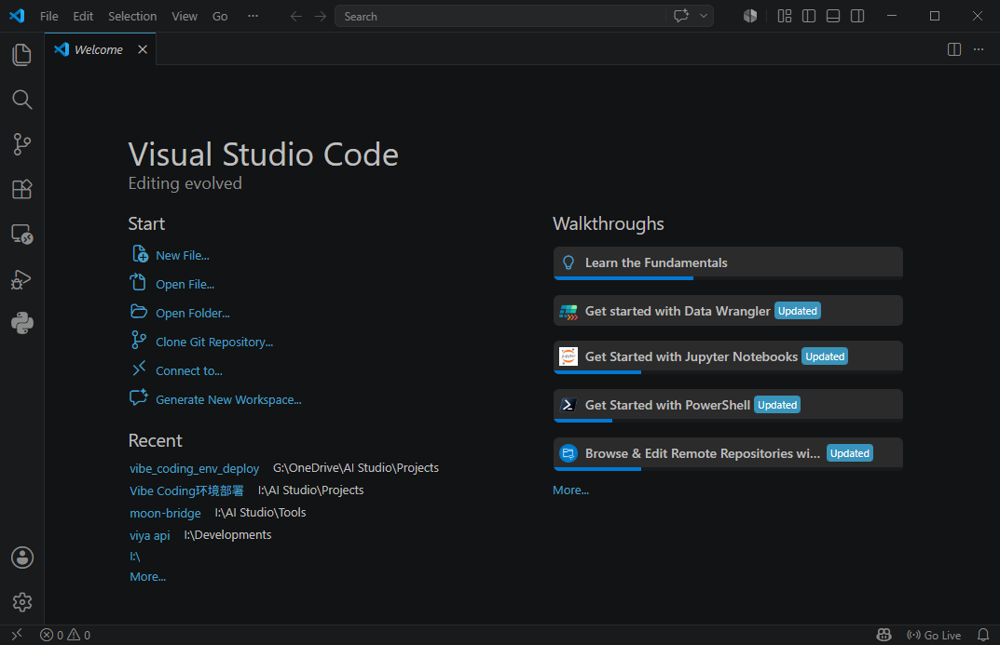

---

## [PowerShell 7](https://learn.microsoft.com/en-us/powershell/scripting/install/install-powershell-on-windows?view=powershell-7.6)

PowerShell 是一个跨平台的任务自动化解决方案，它集成了命令行终端（Shell）、脚本语言以及配置管理框架。同时，PowerShell 支持在 Windows、Linux 和 macOS 系统上运行。

### 官方网站

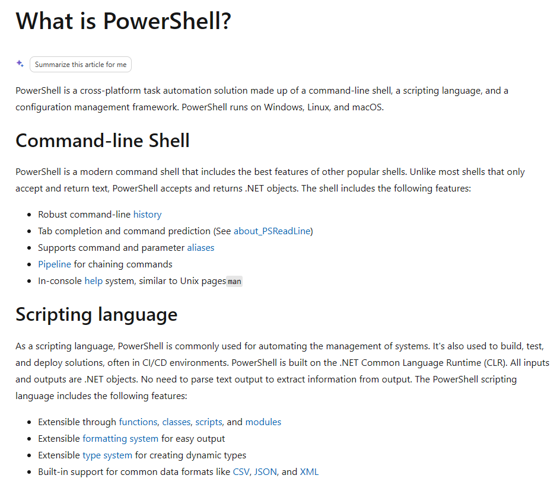

### 安装步骤

1. 参考官方指南，或使用附件`PowerShell-7.6.1-win-x64.msi`安装，点击`Next`

2. 选择安装路径并点击`Next`

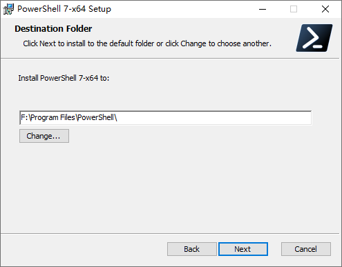

3. 勾选前2个选项并点击`Next`

4. 点击`Next`

5. 点击`Install`

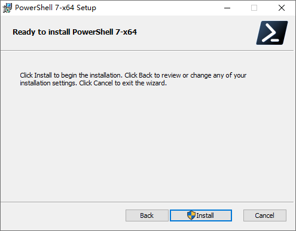

6. 等待安装完成，点击`Finish`

### 验证

1. 可以在开始菜单中找到应用

2. `Win + R`输入`pwsh`可打开终端

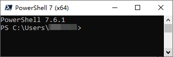

---

## [Windows Terminal](https://apps.microsoft.com/detail/9n0dx20hk701?hl=zh-CN&gl=CN)

Windows 终端程序是一款新式、快速、高效、强大且高效的终端应用程序，适用于命令行工具和命令提示符，PowerShell和 WSL 等 Shell 用户。主要功能包括多个选项卡、窗格、Unicode、和 UTF-8 字符支持，GPU 加速文本渲染引擎以及自定义主题、样式和配置。

### 官方网站

https://apps.microsoft.com/detail/9n0dx20hk701?hl=zh-CN&gl=CN

### 安装步骤

1. 从官网下载安装包，或使用附件`Windows Terminal Installer.exe`安装

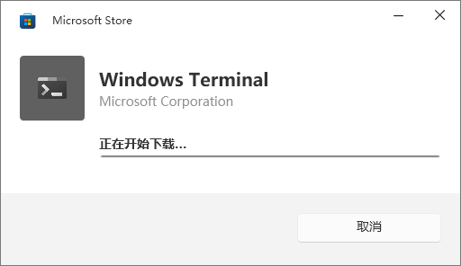

2. 自动下载（过程可能较慢）并安装后，会自动打开终端（默认使用Windows PowerShell）

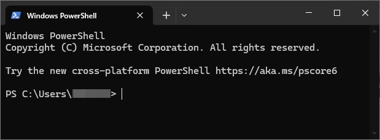

3. 为了默认使用PowerShell 7，点击`设置`

4. 点击`添加新配置文件`、`新建空配置文件`

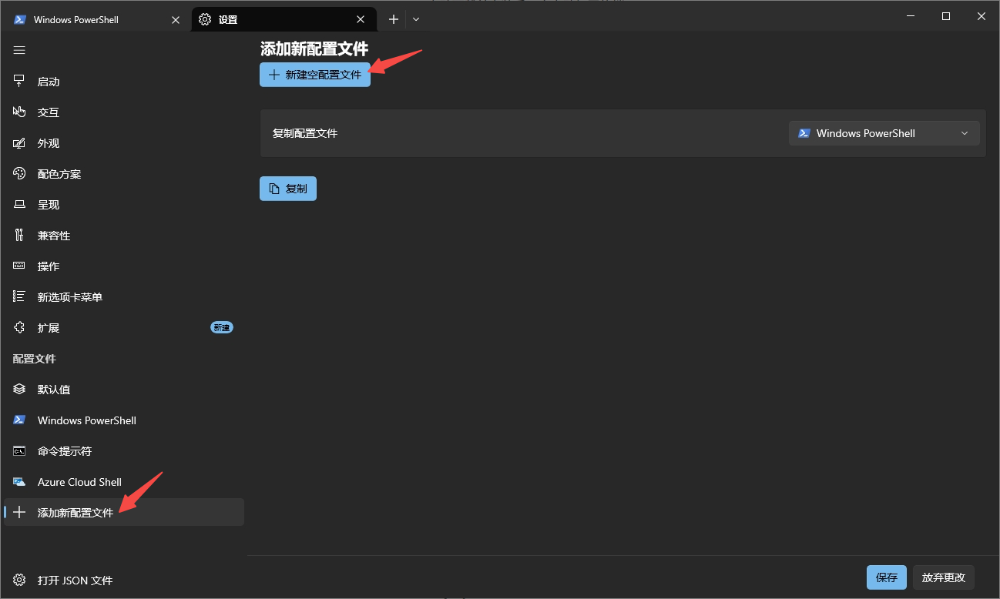

5. 修改名称为`PowerShell 7`、修改命令行可执行文件路径`xxx/pwsh.exe`、点击保存

6. 点击`启动`、`默认配置文件`选择`PowerShell 7`、`默认终端应用程序`选择`Windows 终端`、点击`保存`

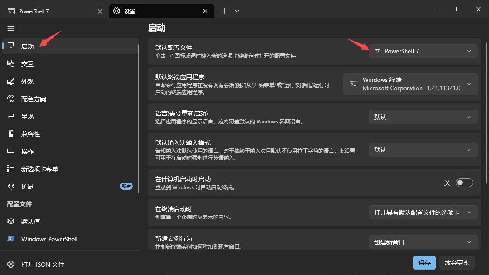

### 验证

1. `Win + R`输入`wt`可默认使用新安装的终端打开PowerShell 7
2. 如下图，可在首行显示PowerShell版本

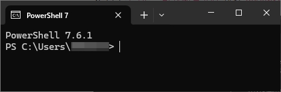

---

## [Node.js](https://nodejs.org/en)

Node.js是一个免费且开源的跨平台 JavaScript 运行时环境，开发者可以利用它来高效地构建服务端、Web 应用程序、命令行工具和自动化脚本。

### 官方网站

https://nodejs.org/en

### 安装步骤

1. 从官网下载安装包，或使用附件`node-v24.15.0-x64.msi`安装

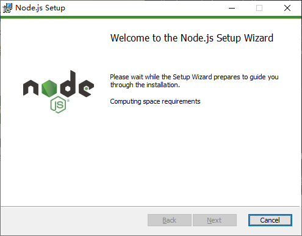

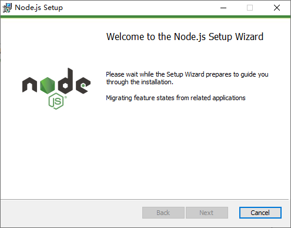

2. 选中`I accept the terms in the License Aggrement`并点击`Next`

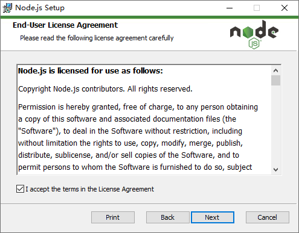

3. 选择安装路径并点击`Next`

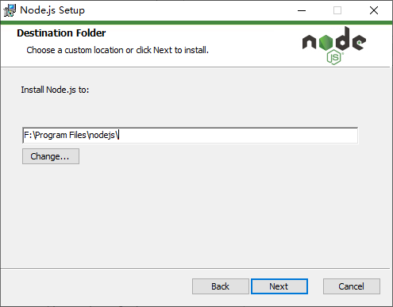

4. 点击`Next`

5. 不勾选，直接点击`Next`

6. 点击`Install`以开始安装

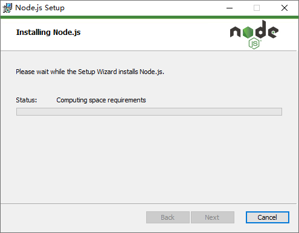

7. 如果之前安装过Node.js，可能会提示选择关闭进程以更新文件，点击`OK`

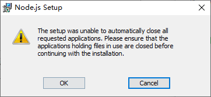

9. 等待安装完成，点击`Finish`

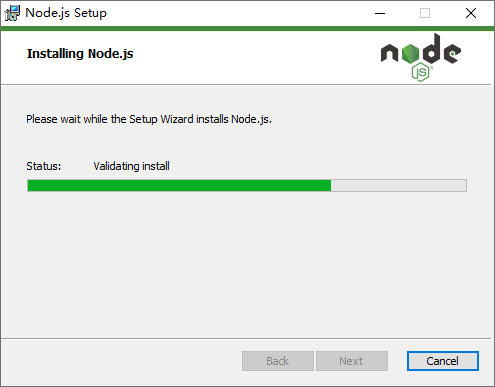

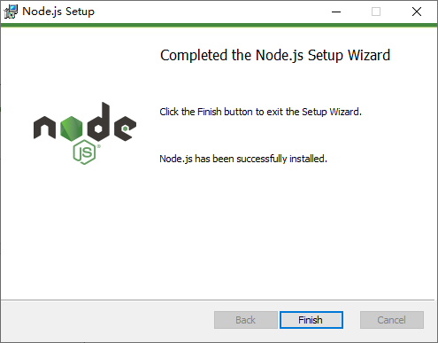

### 验证

1. Node.js 会同时安装包管理器 npm
2. `Win + R` 输入 `wt` 打开 Windows Terminal
3. 分别键入命令 `node --version` 和 `npm --version`
4. 如下图，正常显示版本号则安装成功

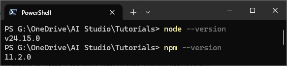

---

## [pnpm](https://pnpm.io/installation)

快速且节省磁盘空间的现代 Node.js 包管理器

### 官方网站

https://pnpm.io/installation

### 安装步骤

1. 确保npm安装成功后，打开终端输入命令 `npm install -g pnpm@latest-11`
2. 如下图，安装结束

### 验证

1. `Win + R` 输入 `wt` 打开Windows Terminal
2. 终端输入命令 `pnpm --version`
3. 如下图，正常显示版本号则安装成功

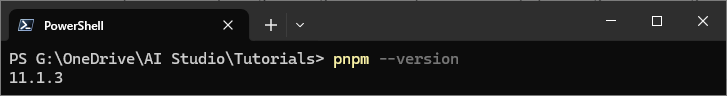

---

## [Git](https://git-scm.com/)

Git 是一款免费且开源的分布式版本控制系统，旨在快速、高效地处理从小型到超大型的所有项目。 Git 的运行速度极快，并拥有一个由图形用户界面（GUI）、托管服务以及命令行工具组成的庞大生态系统。

### 官方网站

https://git-scm.com/

### 安装步骤

1. 从官网下载安装包，或使用附件`Git-2.54.0-64-bit.exe`安装，点击`Next`

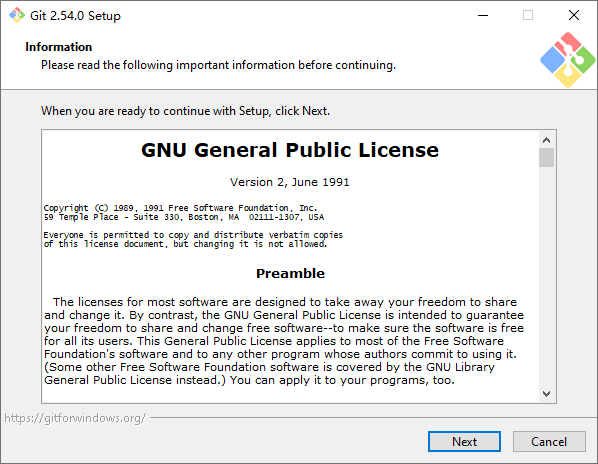

2. 选择安装路径并点击`Next`

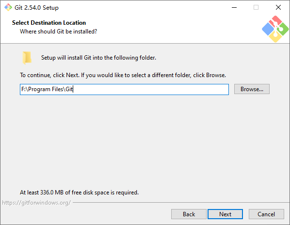

3. 按需勾选组件并点击`Next`

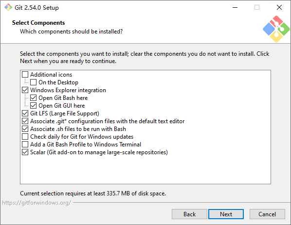

4. 点击`Next`

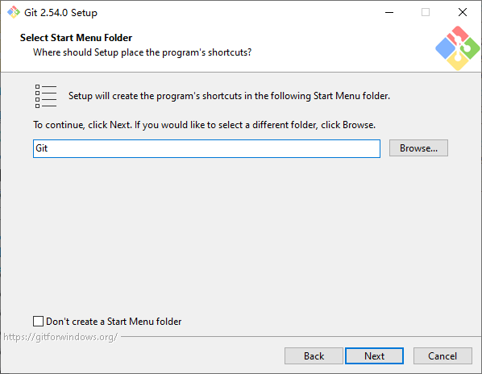

5. 选择`Use Visual Studio Code as Git’s default editor`并点击`Next`

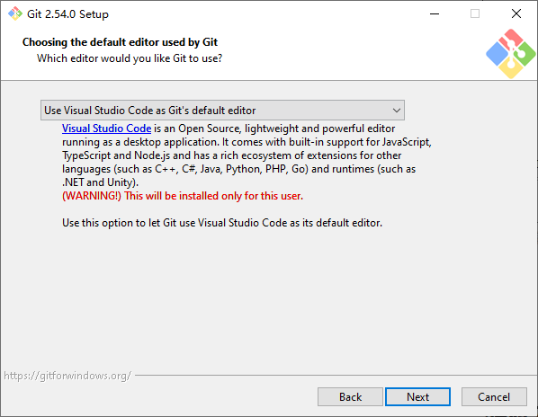

6. 选择`Override the default branch name for new respositories`并点击`Next`

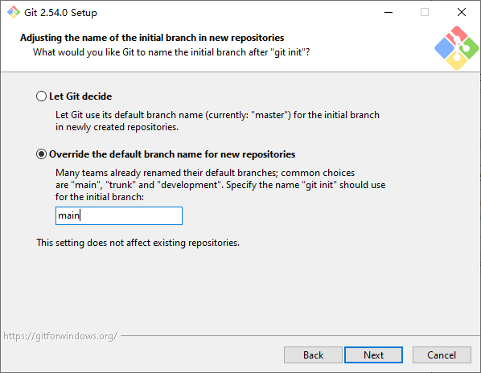

7. 点击`Next`

8. 点击`Next`

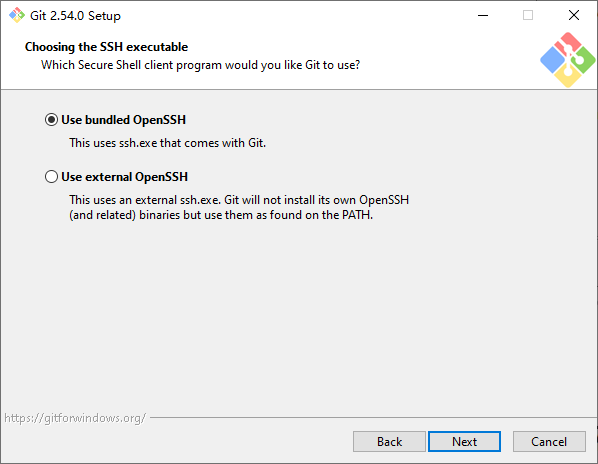

9. 点击`Next`

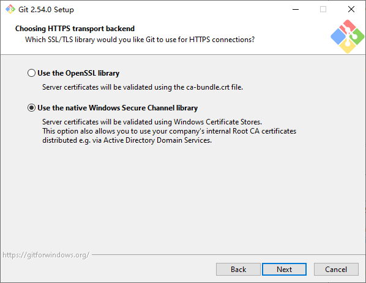

10. 点击`Next`

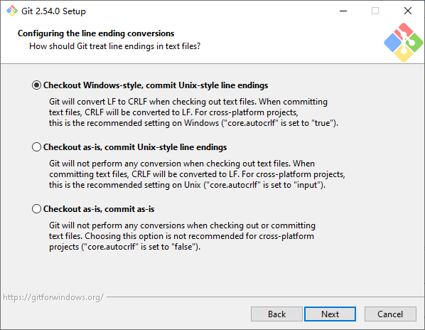

11. 点击`Next`

12. 点击`Next`

13. 点击`Next`

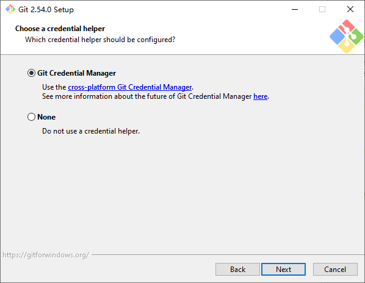

14. 点击`Next`

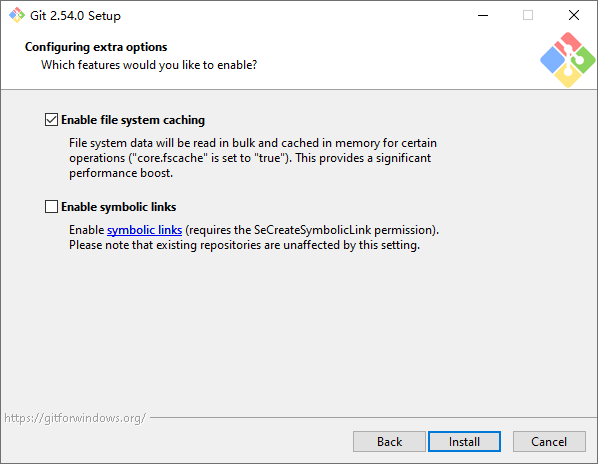

15. 等待安装完成，点击`Finish`

### 验证

1. `Win + R` 输入 `wt` 打开 Windows Terminal
2. 终端输入命令 `git --version`
3. 如下图，正常显示版本号则安装成功

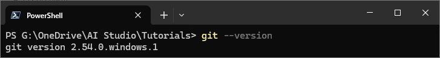

---

# 安装AI开发工具

## [Claude Code](https://code.claude.com/docs/en/overview) - 终端 **CLI**

Claude Code 是一款 AI 编程助手，它能够理解代码库、编辑文件、运行命令、构建新功能、修复 Bug 、自动化开发任务。当你于终端键入 `claude` 时，它默认进入的是一种 **TUI（Text-based User Interface，基于文本的用户界面）**。这种界面通过特殊的字符排版，模拟出了类似聊天软件的窗口（包含顶部的状态栏、中间的对话区、底部的输入框等）。

### 官方网站

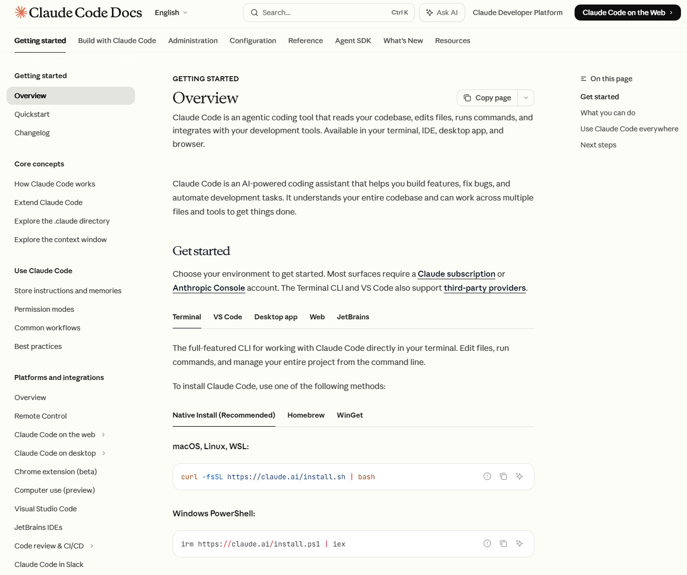

### 安装步骤

选择以下任一方法安装Claude Code：

#### 特殊网络环境允许时，优先使用官方安装方法

终端输入`irm https://claude.ai/install.ps1 | iex`

#### 特殊网络环境不允许时，推荐使用 npm 安装

1. 终端输入`npm install @anthropic-ai/claude-code -g`，自动从npm官方仓库拉取适配当前操作系统的最新版本claude-code包

2. 参考下方验证小节，如见下图提示，重新打开终端并再次尝试；如仍然报错，则继续下方步骤

**！！！以下步骤仅验证失败时进行！！！**

通常情况下，运行 `npm install @anthropic-ai/claude-code -g` 时，npm 会自动生成启动脚本 `claude.ps1` ，这样才能在终端直接敲命令：

1. 终端输入`npm config get prefix`，获取 npm 全局可执行脚本路径，打开对应文件夹
2. 如果存在`claude.ps1` ，则路径可能未成功配置到用户环境变量，需手动添加
3. 如果不存在，终端输入`npm root -g`，获取npm全局安装包根路径，打开对应文件夹，依次打开子文件夹@anthropic-ai、claude-code、bin，可见 `claude.exe` 文件，并将当前文件夹路径手动添加至用户环境变量

### 验证

1. `Win + R` 输入 `wt` 打开Windows Terminal
2. 终端输入命令 `claude --version`
3. 如下图，正常显示版本号则安装成功

---

## Claude Code - VS Code 扩展

VS Code 扩展为 Claude Code 提供了原生图形界面，并直接集成到 IDE 中。借助于该扩展，可以在接受 Claude 的方案之前进行审查和修改、自动接受其实时做出的修改、通过选区以特定的行号范围提及文件、访问对话历史记录，以及在独立的标签页或窗口中打开多个对话。

### 安装步骤

1. 点击左侧栏的`扩展图标`、搜索`claude code`、点击`首个扩展`、点击`Install`

2. 安装后，左侧栏会新增Claude Code扩展图标

---

## [CC Switch](https://github.com/farion1231/cc-switch)

CC Switch 提供了一站式桌面应用，轻松掌控AI CLI 工具。无需再手动修改繁琐的配置文件，只需通过直观的图形界面，即可一键导入服务商、秒级无缝切换。应用内置 50 多种主流服务商预设，支持统一的 MCP 与 Skills 管理以及系统托盘一键闪切——其底层更是由可靠的 SQLite 数据库保驾护航，通过原子写入机制，彻底杜绝配置损坏的风险。

### 官方网站

### 安装步骤

1. 从官方网站下载，或使用附件`CC-Switch-v3.15.0-Windows.msi`安装并点击`Next`

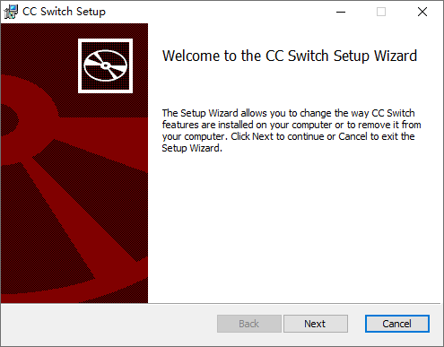

2. 选择安装路径并点击`Next`

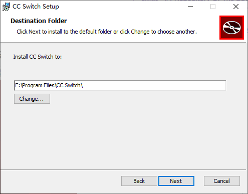

3. 并点击`Install`

4. 等待安装完成，点击`Finish`

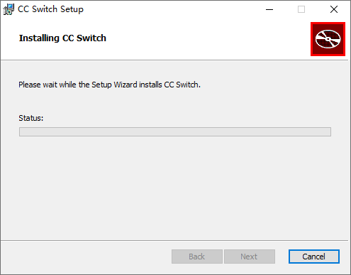

### 配置第三方模型

本教程选用DeepSeek-v4模型

1. [DeepSeek 开放平台](https://platform.deepseek.com/sign_in) 注册并充值

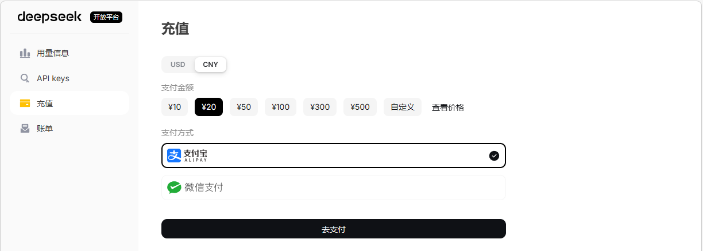

2. 创建API Key

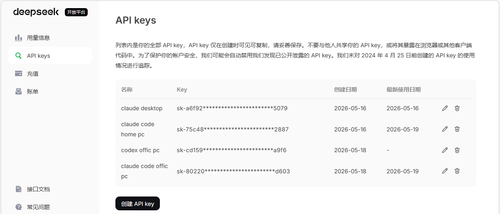

3. 复制API Key（注意：只显示一次，如果遗忘需要重新创建）

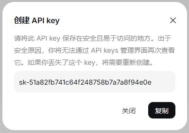

4. 打开CC Switch，点击右上角`+`

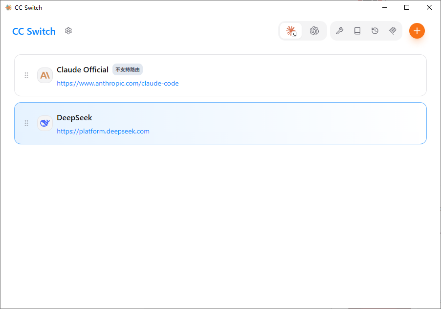

5. 点击`Claude 供应商`

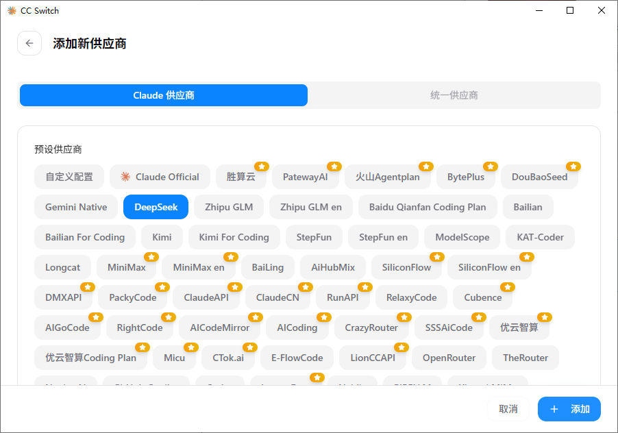

6. 向下滚动，填写刚才复制的`API Key`

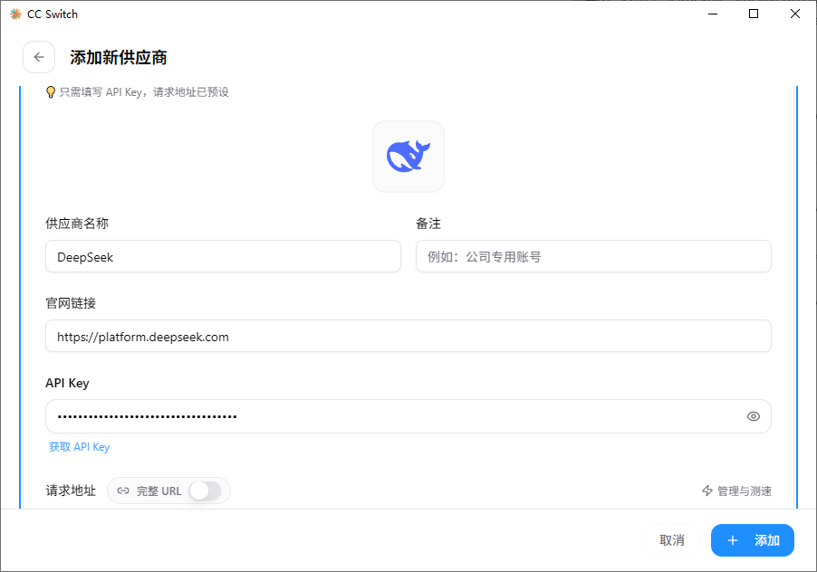

7. 参考下图填写`模型映射`和`默认兜底模型`，最后点击`添加`

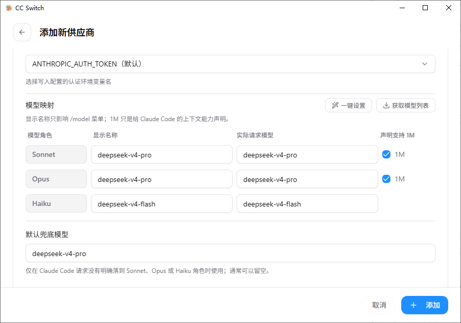

## 验证第三方模型接入

### 以 Claude Code 终端 CLI 为例

1. 打开终端，先cd到项目路径
2. 输入`claude`，可见模型为deepseek-v4-pro
3. 如果是首次安装，会有诸如主题等简单设置的步骤，默认 `Enter` 即可

### 以 Claude Code 扩展为例

1. 打开VS Code，点击`Claude Code扩展`、`New session`
2. 对话框输入`/model`，可见模型为deepseek-v4-pro

至此，Claude Code开发环境所需依赖项、自身应用程序、第三方模型均已安装或配置完成

# 常见问题解答

## Q1：CMD、Windows PowerShell、PowerShell 7、Windows Terminal分别是什么？以及它们之间有什么关系？

首先，我们需要了解 **Kernel(内核)**、**Shell(外壳)** 和 **Terminal(终端)** 的概念。

1. **Kernel**：操作系统的最底层**核心程序**，拥有对计算机硬件的最高控制权，常驻内存。
2. **Shell：**包裹在内核之外的一层**用户接口程序**，是一个命令解释器，充当用户与内核之间的“中间人”。
3. **Terminal：**在现代个人电脑语境下，更准确叫终端模拟器，是一个**图形化应用程序**。

接着，我们再了解它们的定位和特点。

1. **CMD（命令提示符）：初代“老前辈”**

**定位：**Windows 最早的原生命令行工具，基于古老的 DOS 系统设计。

**特点：**功能相对基础，主要用于执行简单的系统命令（如 `ipconfig`、`ping`）或运行老旧的批处理（.bat）脚本。它的界面和自定义程度都非常有限。

2. **Windows PowerShell：系统自带的“全能管家”**

**定位：**微软为了弥补 CMD 的不足推出的新一代 Shell，预装在 Windows 10/11 中（通常是 5.x 版本）。

**特点：**功能极其强大，专为系统管理和自动化运维设计。它不仅能兼容大部分 CMD 命令，还支持复杂的脚本编写和调用 .NET 框架，是 Windows 系统管理的核心工具。

3. **PowerShell 7：跨平台的“现代进化版”**

**定位：**PowerShell 的开源、跨平台（支持 Windows、macOS、Linux）升级版。

**特点：**基于现代 .NET 构建，性能更强，拥有更多新特性（如并行处理、新的运算符等）。它与系统自带的 Windows PowerShell 5.x 可以并存（执行文件名为 pwsh.exe，老版本是 powershell.exe），互不冲突。

4. **Windows Terminal：统一的“现代化外壳”**

**定位：**微软推出的现代化终端应用程序，它本身不带有任何命令处理能力。

**特点：**它的作用是把 CMD、PowerShell 5.x、PowerShell 7，甚至是 Linux 子系统（WSL）、Git Bash 等全部装进同一个窗口里。它支持多标签页、分屏、GPU 加速渲染、高度自定义主题等可视化功能。

综上，我们可以直观地把 Windows Terminal 想象成一个**现代化的浏览器**，而 CMD、Windows PowerShell 和PowerShell 7 等则是该浏览器里打开的不同**网页**。

## Q2：Node.js、npm、pnpm分别是什么？以及它们之间有什么关系？

首先，我们需要了解**Runtime Environment****(运行时环境)** 和 **Package Manager****(包管理器)** 的概念。

1. **Runtime Environment**：一个能让特定编程语言脱离常规运行平台（如浏览器），在计算机底层直接运行的**软件环境**。
2. **Package Manager****：**用于自动化安装、升级、配置第三方代码库（即“包”）的**包管理工具**。

接着，我们再了解它们的定位和特点。

1. **Node.js：让 JavaScript 走出浏览器的“全能引擎”**

**定位：**基于 Chrome V8 引擎封装的 JavaScript 运行环境，是前端工程化和后端开发的基础。

**特点：**它让 JavaScript 不仅能写网页交互，还能开发高性能的后端服务（如 API 接口）、编写自动化脚本、开发命令行工具（CLI）以及桌面应用等。

2. **npm：生态自带的“默认仓库管理员”**

**定位：**随 Node.js 一同安装的官方包管理器，是全球最大的软件注册表。

**特点：**通过 `package.json` 文件来管理项目依赖，拥有极其庞大的开源包资源。开发者使用 `npm install` 命令即可轻松下载和使用社区提供的代码，是兼容性最好的选择。

3. **pnpm：节省空间的“极速仓库管理员”**

**定位：**专为提升性能和节省资源而生的第三方包管理器，需要独立安装。

**特点：**传统的 npm 会在每个项目中重复复制相同的依赖文件，占用大量磁盘空间。而 pnpm 创新地使用了“硬链接”机制，让所有项目共享同一份依赖文件副本。这不仅极大地节省了磁盘空间，还大幅提升了依赖包的安装速度，特别适合大型项目或多包仓库（Monorepo）。

综上，我们可以直观地把 Node.js 想象成**手机操作系统**，npm 是系统自带的**官方应用商店**，pnpm 则是第三方推出的**极速版应用商店**。

## Q3：Git在AI开发项目过程中扮演了什么角色？

AI 极速开发项目的爽感背后潜藏着一个致命问题：AI 可能会突然“发疯”或“失智”，改崩项目或者生成大量无法运行的代码，且很难感知出错的位置，甚至要被迫删库重头再来。

因此，需要 Git 扮演以下几个关键角色：

1. **项目的“存档点”**  
  当 AI 完成某个功能并且项目能正常运行时，AI 可以自动调用`commit`操作进行“存档”。一旦 AI 下一次修改把项目改崩了，你可以通过 Git 回退到上一个能正常运行的“存档点”，毫发无伤。
2. **AI 的“安全实验场”**  
  当想要尝试一个大胆的新想法，或者让 AI 重构某块核心代码时，可以先创建一个新分支`checkout`。在这个分支里，如果改得好，就合并回主分支；如果改崩了，直接删掉这个分支即可，完全不会影响原本稳定运行的主项目。
3. **代码的“云端保险箱”**  
  可将本地的 Git 仓库推送到远程平台（如 GitHub、Gitee、GitLab），相当于把代码资产实时备份到云端。
4. **与 AI 编程工具无缝融合**  
  现在的 AI 编程工具（如 Claude Code）都已经深度集成了 Git，即能直接用自然语言调用 Git。例如，对 AI 说：“帮我撤销上一次的修改”或者“帮我把这次的改动提交并推送到远程”，AI 就会在后台自动执行对应的 Git 命令。

综上，Git 让你在面对 AI 生成的海量代码时，拥有天马行空的想象和随时可以重来的底气。

## Q4：Claude Code 终端 CLI 和 VS Code 扩展有什么差异？

> [Use Claude Code in VS Code - Claude Code Docs](https://code.claude.com/docs/en/vs-code#vs-code-extension-vs-claude-code-cli)

Claude Code 既提供 CLI（终端中的命令行界面），也提供 VS Code 扩展程序（图形化面板）。部分功能仅在 CLI 中可用。如果你需要某个仅限 CLI 的功能，可以在 VS Code 的集成终端中运行 `claude` 命令。

| 功能  | CLI | VS Code 扩展程序 |
| --- | --- | --- |
| 命令和技能 (Commands and skills) | 全部支持 | 部分支持 |
| MCP 服务器配置 | 支持  | 部分支持 |
| 检查点 (Checkpoints) | 支持  | 支持  |
| `!` Bash 快捷指令 | 支持  | 不支持 |
| Tab 自动补全 | 支持  | 不支持 |

1. **在 VS Code 中运行 CLI**

若要在 VS Code 内使用 CLI，请打开集成终端（Windows/Linux 上按 `` Ctrl+` ``，Mac 上按 `` Cmd+` ``）并运行 `claude`。CLI 会自动与你的 IDE 集成，以支持差异查看（diff viewing）和诊断共享等功能。 如果使用外部终端，请在 Claude Code 中运行 `/ide` 以将其连接到 VS Code。

2. **在扩展程序与 CLI 之间切换**

扩展程序和 CLI 共享同一个对话历史。若要在 CLI 中继续扩展程序里的对话，请在终端中运行 `claude --resume`。这将打开一个交互式选择器，你可以从中搜索并选择你的对话。

3. **在提示词中包含终端输出**

你可以使用 `@terminal:name`（其中 `name` 是终端的标题）在提示词中引用终端输出。这让 Claude 无需复制粘贴就能直接看到命令输出、错误信息或日志。

## Q5：如何编辑用户环境变量？

1. `Win + R` 输入 `sysdm.cpl`，打开`系统属性`窗口，依次点击`高级`、`环境变量`

2. 在 `用户变量` 中找到 `Path`

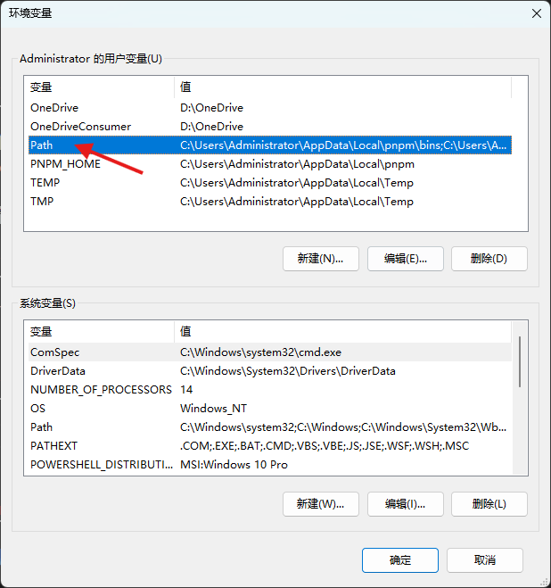

3. 双击打开 `编辑环境变量` 窗口，点击 `新建`，填入路径即可

4. 点击 `确定` 以保存更改

## Q6：为什么安装完应用程序后，终端输入命令却报错？

通常情况下，由于应用安装时才会添加环境变量，而此前已打开的终端无法获取新应用启动脚本的路径，此时重启终端可直接解决；如果是安装过程中环境变量没有成功自动配置，则需要手动编辑，然后重启终端。

## Q7：既然 pnpm 更为高效，为什么不推荐 pnpm 安装 Claude Code CLI？

1. **全局命令的执行机制差异**

pnpm 的核心优势是“基于硬链接的内容寻址存储”，它极度节省磁盘空间，但这套机制主要是为**项目级依赖**设计的。对于安装一个单独的 CLI 工具来说，pnpm 并没有发挥出它最核心的省空间优势，反而因为多了一层 pnpm 自身的封装逻辑，在跨平台生成全局命令（比如让终端直接识别 `claude` 这个命令）时，偶尔会出现路径映射不如 npm 直接的情况。

2. **运行时的依赖解析逻辑**

Claude Code 本质上是一个由 TypeScript 编写、依赖 Node.js 运行的 CLI 工具。npm 的扁平化结构与 Node.js 的原生模块解析器契合度是最高的。对于这种强依赖 Node.js 运行时的独立 CLI 工具来说，使用最原始的 npm 安装，能最大程度避免因符号链接、依赖提升等机制带来的潜在路径解析异常。

综上，如果是给一个具体的前端项目里添加依赖，pnpm 绝对是更优解；但如果是安装像 Claude Code 这种独立运行的全局 CLI 工具，npm 这种自带且直接的方式在底层运行上反而更纯粹、更不容易出错。