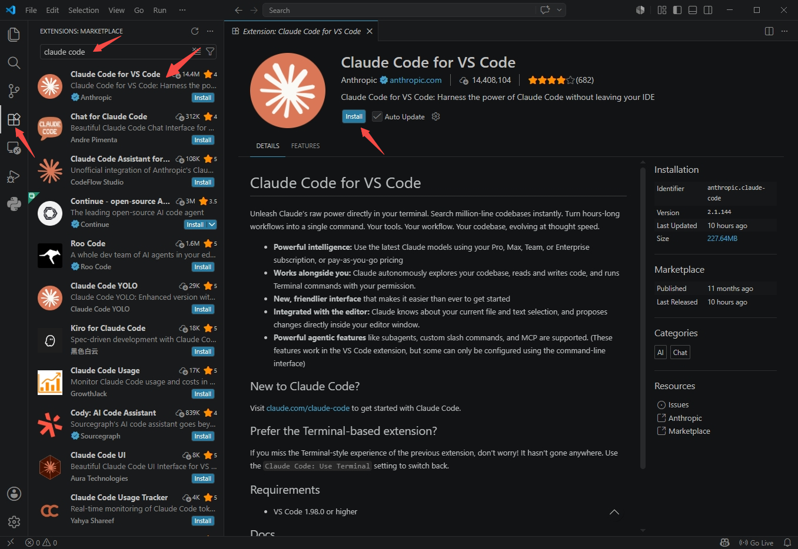
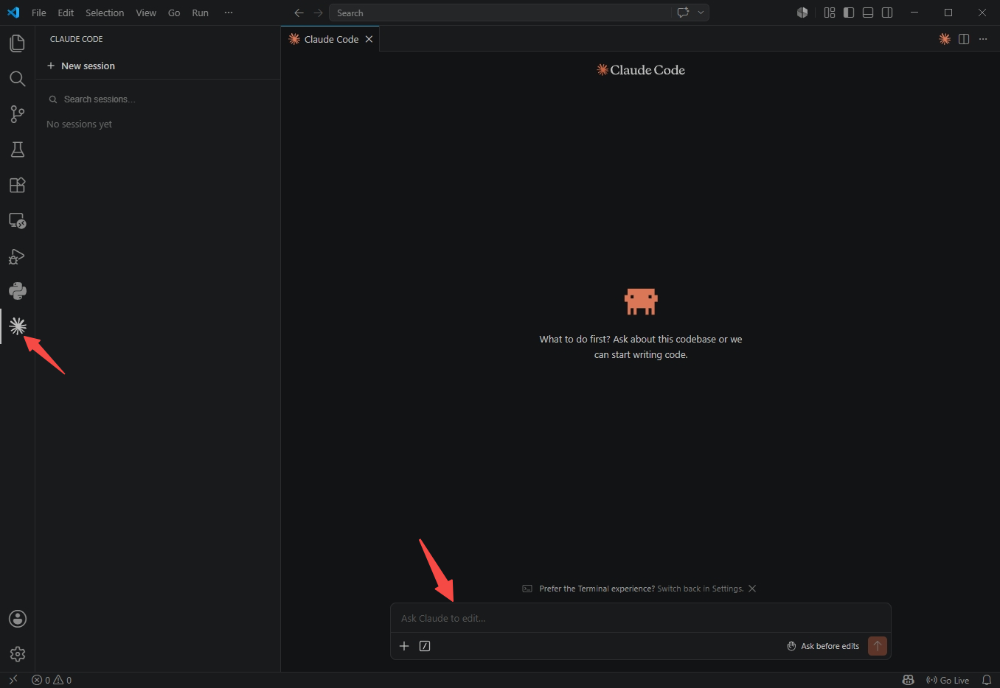

# Claude Code - VS Code 扩展

VS Code 扩展为 Claude Code 提供了原生图形界面，并直接集成到 IDE 中。借助于该扩展，可以在接受 Claude 的方案之前进行审查和修改、自动接受其实时做出的修改、通过选区以特定的行号范围提及文件、访问对话历史记录，以及在独立的标签页或窗口中打开多个对话。

## 安装步骤

1. 点击左侧栏的 `扩展图标`、搜索 `claude code`、点击 `首个扩展`、点击 `Install`

2. 安装后，左侧栏会新增 Claude Code 扩展图标

