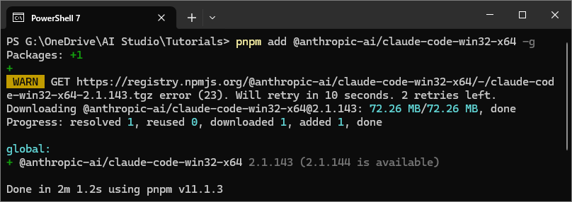
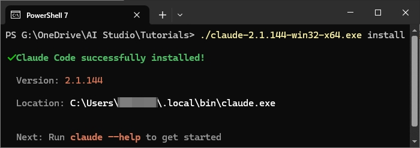

# Claude Code 终端

[Claude Code](https://code.claude.com/docs/en/overview) 是一款智能体（Agentic）编程工具，它能够阅读您的代码库、编辑文件、运行命令，并与您的开发工具无缝集成。该工具现已登录终端、IDE、桌面应用及浏览器。

Claude Code 是一款由 AI 驱动的编程助手，旨在帮助您构建新功能、修复 Bug 并自动化开发任务。它能够理解您的整个代码库，并跨多个文件和工具高效协同以完成工作。


## 官方网站


## 安装步骤

选择以下任一方法安装Claude Code

1. 网络环境允许时，优先选择官方推荐的命令行安装方法

```powershell
irm https://claude.ai/install.ps1 | iex
```

2. 网络环境不允许时，可使用pnpm安装，终端输入命令

```powershell
pnpm add @anthropic-ai/claude-code-win32-x64 -g
```



3. 无网络安装，使用附件`claude-2.1.144-win32-x64.exe`，终端输入命令

```powershell
# 例如，可执行文件存放在 G:\OneDrive\AI Studio\Tutorials
cd G:\OneDrive\AI Studio\Tutorials

# 自动安装
./claude-2.1.144-win32-x64.exe install
```



## 验证

1. 终端输入命令 `claude --version`
2. 如下图，正常显示版本号则安装成功


