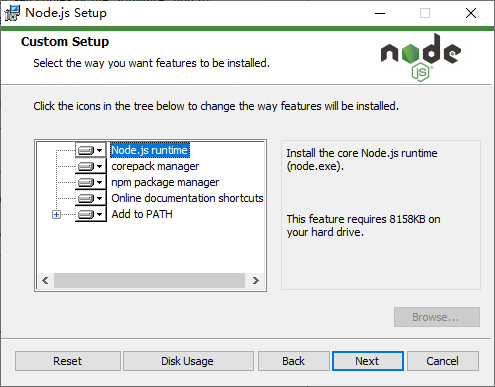
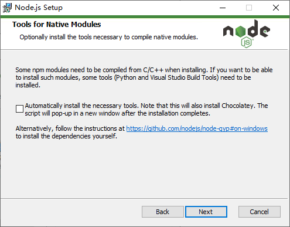
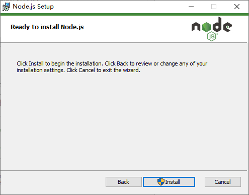
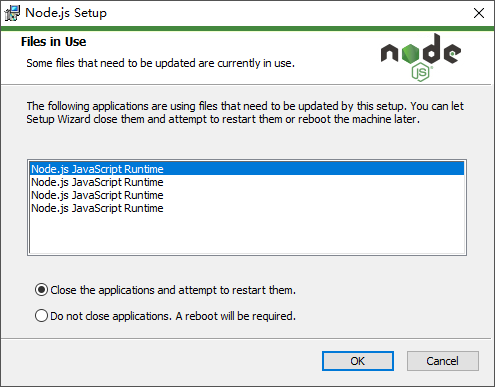

# Node.js

[Node.js](https://nodejs.org/en) 是一个免费且开源的跨平台 JavaScript 运行时环境，开发者可以利用它来高效地构建服务端、Web 应用程序、命令行工具和自动化脚本。

## 官方网站

  <iframe src="https://nodejs.org/en" loading="lazy">
  </iframe>
  

    如果页面未能加载（大部分官网禁止嵌入），请直接访问：
    <a href="https://nodejs.org/en" target="_blank" rel="noopener noreferrer">https://nodejs.org/en</a>
  

## 安装步骤

1. 从官网下载安装包，或使用附件`node-v24.15.0-x64.msi`安装

2. 选中`I accept the terms in the License Aggrement`并点击`Next`

3. 选择安装路径并点击`Next`

4. 点击`Next`

5. 不勾选，直接点击`Next`

6. 点击`Install`以开始安装

7. 如果之前安装过Node.js，可能会提示选择关闭进程以更新文件，点击`OK`

9. 等待安装完成，点击`Finish`

## 验证

1. Node.js会同时安装包管理器npm
2. `Win + R`输入`wt`打开Windows Terminal
3. 分别键入命令 `node --version` 和 `npm --version`
4. 如下图，正常显示版本号则安装成功

