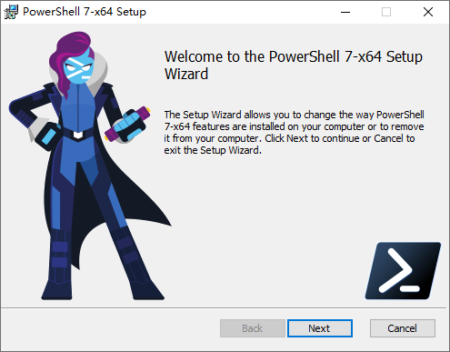
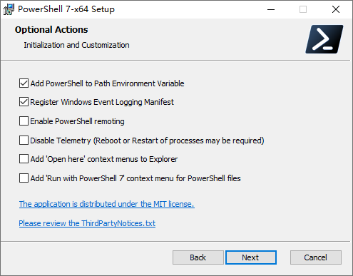
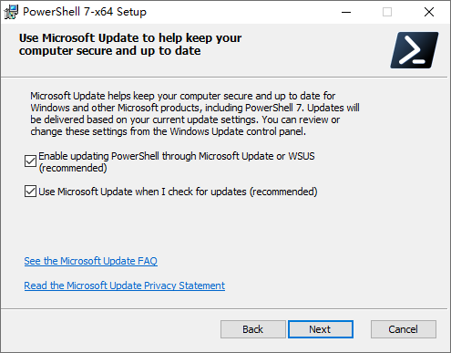
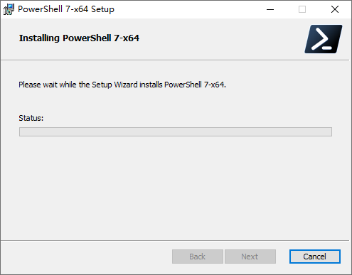
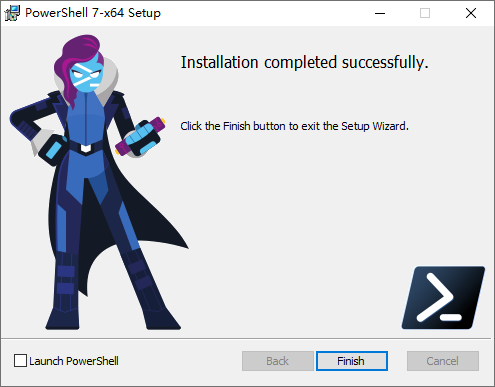
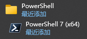

# PowerShell 7

[PowerShell 7](https://learn.microsoft.com/en-us/powershell/scripting/install/install-powershell-on-windows?view=powershell-7.6) 是一个跨平台的任务自动化解决方案，它集成了命令行终端（Shell）、脚本语言以及配置管理框架。同时，PowerShell 支持在 Windows、Linux 和 macOS 系统上运行。

## 官方网站

## 安装步骤

1. 参考官方指南，或使用附件`PowerShell-7.6.1-win-x64.msi`安装，点击`Next`

2. 选择安装路径并点击`Next`

3. 勾选前2个选项并点击`Next`

4. 点击`Next`

5. 点击`Install`

6. 等待安装完成，点击`Finish`

## 验证

1. 可以在开始菜单中找到应用

2. `Win + R`输入`pwsh`可打开终端

