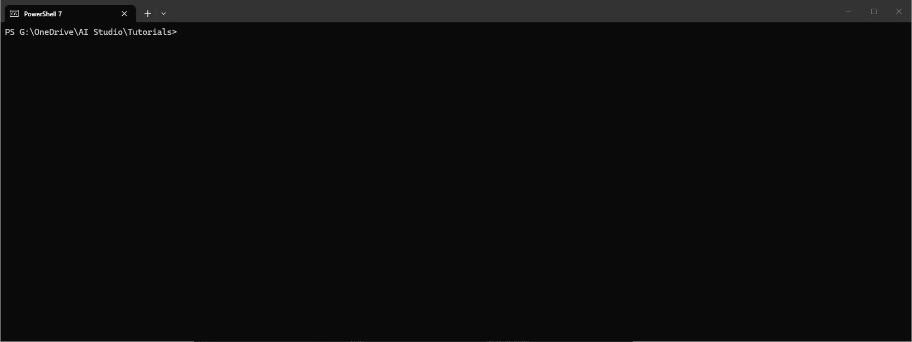
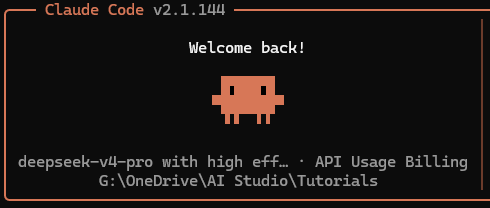

# 验证第三方模型接入

完成 CC Switch 的第三方模型配置后，可以通过以下方式验证模型是否已正确接入。

## 以 Claude Code 终端为例

1. 打开终端，先 cd 到项目路径
2. 输入 `claude`，可见模型为 deepseek-v4-pro
3. 如果是首次安装，会有诸如主题等简单设置的步骤，默认 `Enter` 即可

## 以 Claude Code 扩展为例

1. 打开 VS Code，点击 `Claude Code 扩展`、`New session`
2. 对话框输入 `/model`，可见模型为 deepseek-v4-pro

至此，Claude Code 开发环境所需依赖项、自身应用程序、第三方模型均已安装或配置完成。
