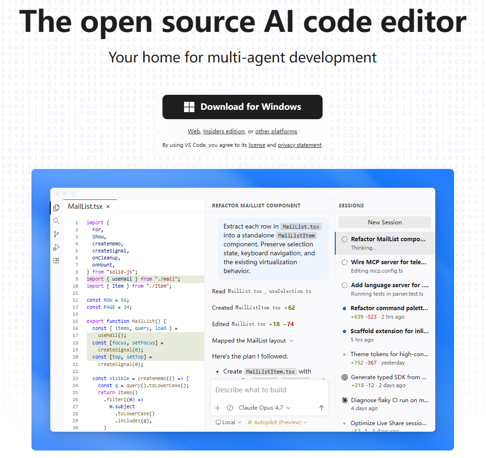
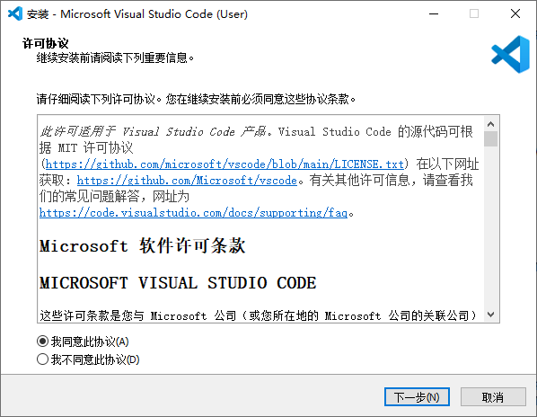
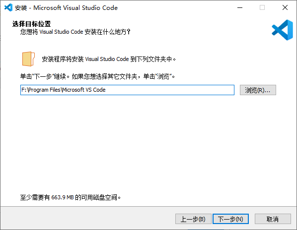
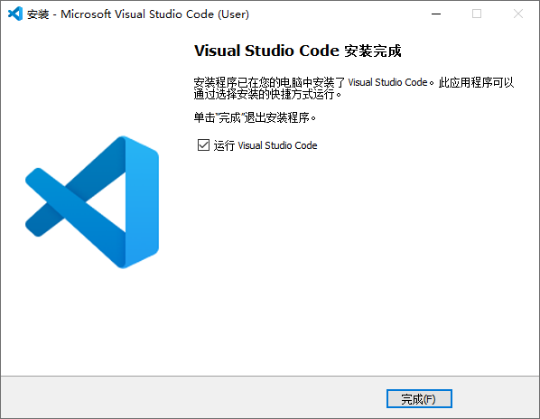
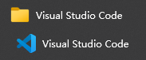

# Visual Studio Code

[Visual Studio Code](https://code.visualstudio.com/)（简称 VS Code）是一款跨平台的代码编辑器，支持 Windows、macOS 和 Linux。

VS Code 运行十分轻快，对绝大多数硬件设备和操作系统版本都能完美兼容。

## 官方网站

## 安装步骤

1. 参考官方指南，或使用附件安装
  1. 如果有管理员权限，使用 **System Installer** `VSCodeSetup-x64-1.120.0.exe`
  2. 否则，使用 **User Installer** `VSCodeUserSetup-x64-1.120.0.exe`
2. 选择 `我同意此协议` 并点击 `下一步`

3. 如果使用 System Installer，有额外步骤

选择安装路径并点击 `下一步`

点击 `下一步`

4. 按需选择附加任务并点击 `下一步`

4. 点击 `安装`

5. 等待安装完成，点击 `完成`

## 验证

1. 开始菜单找到应用

2. 打开后界面如下图

