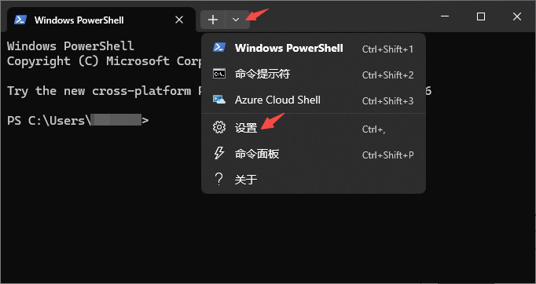
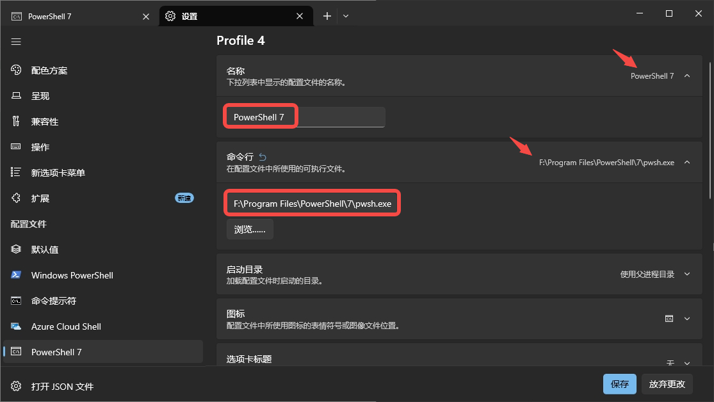

# Windows Terminal

[Windows Terminal](https://apps.microsoft.com/detail/9n0dx20hk701?hl=zh-CN&gl=CN) 是一款新式、快速、高效、强大且高效的终端应用程序，适用于命令行工具和命令提示符，PowerShell和 WSL 等 Shell 用户。主要功能包括多个选项卡、窗格、Unicode、和 UTF-8 字符支持，GPU 加速文本渲染引擎以及自定义主题、样式和配置。

## 官方网站

  <iframe src="https://apps.microsoft.com/detail/9n0dx20hk701?hl=zh-CN&gl=CN" loading="lazy">
  </iframe>
  

    如果页面未能加载（大部分官网禁止嵌入），请直接访问：
    <a href="https://apps.microsoft.com/detail/9n0dx20hk701?hl=zh-CN&gl=CN" target="_blank" rel="noopener noreferrer">https://apps.microsoft.com/detail/9n0dx20hk701?hl=zh-CN&gl=CN</a>
  

## 安装步骤

1. 从官网下载安装包，或使用附件`Windows Terminal Installer.exe`安装

2. 自动下载（过程可能较慢）并安装后，会自动打开终端（默认使用Windows PowerShell）

3. 为了默认使用PowerShell 7，点击`设置`

4. 点击`添加新配置文件`、`新建空配置文件`

5. 修改名称为`PowerShell 7`、修改命令行可执行文件路径`xxx/pwsh.exe`、点击保存

6. 点击`启动`、`默认配置文件`选择`PowerShell 7`、`默认终端应用程序`选择`Windows 终端`、点击`保存`

## 验证

1. `Win + R`输入`wt`可默认使用新安装的终端打开PowerShell 7
2. 如下图，可在首行显示PowerShell版本

