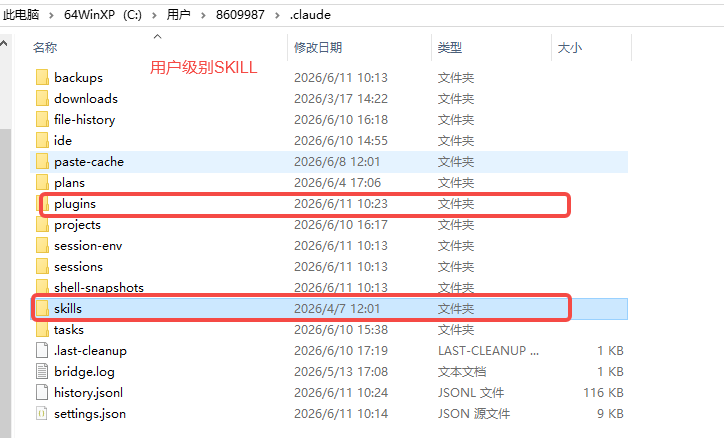
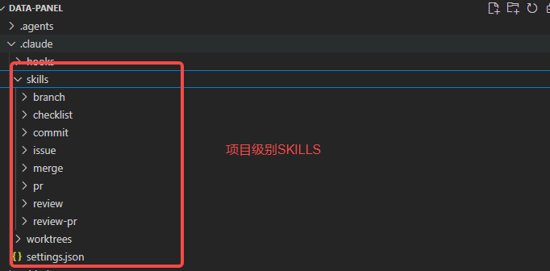
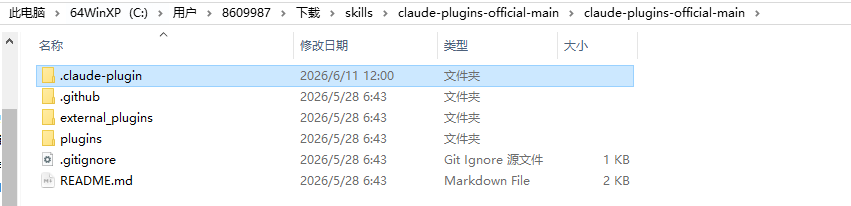
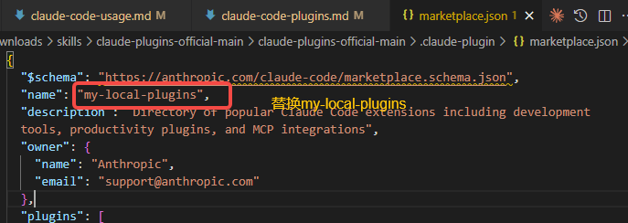
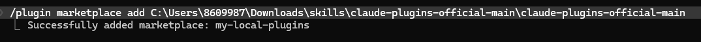

# Claude Code Skill 与插件

Claude Code 提供了 **Skills（技能）** 和 **Plugins（插件）** 两套扩展机制来增强 AI 编程能力。Skills 聚焦于对话中的专项任务（如 PPT 生成、PDF 处理、数据可视化），Plugins 提供 IDE 层面的工具集成。

## 什么是 Skill

Skill 本质上是**一组指令、脚本和资源的文件夹**，Claude 会动态加载它们以提高在特定任务上的性能。它教会 Claude 如何以可重复的方式完成特定任务——无论是用公司品牌指南创建文档、按团队工作流分析数据，还是自动化个人任务。举个例子：如果你经常写爬虫，每个网站的规则都不同。把不同网站的爬虫规则存成 Skill，下次只需一句"帮我爬 XX 网站"，Claude Code 就不需要从零写代码了。

| 目录 | 作用范围 |
|------|----------|
| `.claude/skills/` | 当前项目可用 |
| `~/.claude/skills/` | 所有项目全局可用 |

**用户级别SKILL，所有项目全局可用**

**项目级别SKILL，当前项目可用，一般是项目定制SKILL**


> Skill 文件在 `.claude/skills/` 目录下，每个 Skill 是一个子文件夹，核心是其中的 `SKILL.md` 指令文件。

## 通过 Marketplace 安装

这是官方推荐的安装方式，**适合联网环境**。建议在 Claude Code CLI 中进行操作。

Claude Code 有两个官方 Marketplace 源：

| Marketplace | 地址 | 内容 |
|-------------|------|------|
| **Plugins** | `anthropics/claude-plugins-official` | LSP 语言支持、GitHub/Slack/Jira 集成、PR 审查、插件开发工具等 |
| **Skills** | `anthropics/skills` | 文档办公（pptx/pdf/xlsx/docx）、前端设计、可视化、Web 测试等 Agent Skill |

### 添加 Marketplace

1. 在 Claude Code 中输入 `/plugin` 打开插件管理面板

<!-- TODO: 待补充图片 plugin.png -->

2. 选择第三个选项 **Add Marketplace**

<!-- TODO: 待补充图片 marketplace.png -->

3. 输入要添加的仓库地址：

<!-- TODO: 待补充图片 marketplace2.png -->

```
# Skills 市场
https://github.com/anthropics/skills

# 官方插件市场
https://github.com/anthropics/claude-plugins-official
```

> 该步骤可能需要网络代理访问 GitHub。如无法访问，参考下方的离线安装方式。

4. 仓库加载成功后按回车查看详情，确认后选择 **Install now** 完成安装
<!-- TODO: 待补充图片 plugin_install.png -->
<!-- TODO: 待补充图片 plugin2.png -->

重复以上步骤可添加两个官方源，也可添加社区维护的镜像仓库。

### 验证安装

安装成功后，项目目录下会出现 marketplace 文件夹：

```
C:\Users\用户名称\
└── .claude/
    └── plugins/
        └── marketplace/    # Marketplace 配置与 Skill 缓存
```

**重启 Claude Code**，在对话中输入 `/skills` 即可看到新安装的 Skill 列表。

## 离线安装（无 VPN / 内网环境）

部分同事因网络限制无法访问 GitHub 或 Skills 市场，可通过以下方式手动安装。

### 离线安装市场（Marketplace）

如果你已经从同事或共享盘拿到了完整的市场仓库，可以通过本地路径注册市场，无需联网。

**Step 1 — 获取市场仓库**

从接从同事或团队共享盘将整个市场文件夹复制到本地，解压文件。


**Step 2 — 修改配置文件**

点击.claude-plugin文件夹。

编辑修改 marketplace.json 中的 name 字段，换成其他名称。
```bash
my-local-plugins
```



**Step 3 — 离线安装市场**
```bash
# 注册本地市场（使用绝对路径）
/plugin marketplace add C:\Users\用户名\Downloads\skills\claude-plugins-official-main\claude-plugins-official-main
```


### 离线安装SKILL
**Step 1 — 获取 Skill 文件**

访问 [https://github.com/anthropics/skills](https://github.com/anthropics/skills)，点击 **Code > Download ZIP** 下载整个仓库。

解压后可以看到各个 Skill 文件夹，常用的包括：

- `xlsx/` — Excel 电子表格
- `docx/` — Word 文档
- `frontend-design/` — 前端界面设计

> 如无法访问 GitHub，可通过**同事分享**或**团队内部共享盘**获取以上 Skill 文件夹的压缩包。

**Step 2 — 放置 Skill 文件**

将需要的 Skill 文件夹复制到用户目录下的 `.claude/skills/`：

```
C:\Users\<你的用户名>\.claude\skills\
├── xlsx/
│   └── SKILL.md
├── docx/
│   └── SKILL.md
├── frontend-design/
│   └── SKILL.md
```

<!-- TODO: 待补充图片 skills.png -->

**Step 3 — 验证安装**

**重启 Claude Code**，在对话中输入 `/skills`，列表中出现 `document-skills`、`frontend-design` 等 Skill 即表示安装成功。


## 常用 Skill 速查

### 文档办公

| Skill | 触发方式 | 用途 | 典型场景 |
|-------|----------|------|----------|
| PPT | `/pptx` | 生成带图表和图片的完整演示文稿 | 周报、汇报、方案展示 |
| PDF | `/pdf` | 读取、合并、提取、加密 PDF 文件 | 合同提取、报告合并 |
| Excel | `/xlsx` | 创建和编辑 Excel 文件，含公式和图表 | 数据分析报表、CSV 转 Excel |
| Word | `/docx` | 创建和编辑 Word 文档，含目录和页眉页脚 | 专业文档排版 |

### 设计与可视化

| Skill | 触发方式 | 用途 | 典型场景 |
|-------|----------|------|----------|
| **frontend-design** | `/frontend-design` | 生成精美的前端界面，支持 React / HTML | 仪表盘、登录页、数据看板 |
| **canvas-design** | `/canvas-design` | 生成海报、插画等静态视觉设计 | 活动封面、Logo、宣传物料 |

### 开发与效率

| Skill | 触发方式 | 用途 | 典型场景 |
|-------|----------|------|----------|
| **skill-creator** | `/skill-creator` | 创建和修改自定义 Skill，封装团队工作流 | 将重复性任务沉淀为可复用技能 |
| **find-skills** | `/find-skills` | 搜索和浏览 Skills 市场，发现新技能 | 查找是否有现成 Skill 满足当前需求 |

### 开发流程（Superpowers）

Superpowers 是一套覆盖完整开发周期的流程类 Skill，将"先想清楚再动手"的工程纪律在 Claude Code 中自动化执行。

| Skill | 触发方式 | 典型场景 |
|-------|----------|----------|
| **brainstorming** | brainstorming | 新功能设计、技术改造方案讨论 |
| **writing-plans** | writing-plans | 多文件改动前的方案设计 |
| **test-driven-development** | test-driven-development | Bug 修复、新功能开发 |
| **systematic-debugging** | systematic-debugging | 遇到报错、测试失败时 |
| **verification-before-completion** | verification-before-completion | 提交代码前的最终检查 |
| **requesting-code-review** | requesting-code-review | 合并前自查代码质量 |
| **subagent-driven-development** | subagent-driven-development | 需要同时修改多个模块 |
| **using-git-worktrees** | using-git-worktrees | 多分支并行开发 |

> **使用建议**：将 Superpowers 设为默认加载，配合 CLAUDE.md 记忆系统，可让 Claude Code 在每个开发任务中自动遵循工程纪律。

> 完整技能列表和最新更新请参考 [Claude Code Skills 市场](https://github.com/anthropics/skills)。

## 参考文章

#### Skills 与插件

| 文章 | 来源 | 说明 |
|------|------|------|
| [Claude Code Skills 市场](https://github.com/anthropics/skills) | 社区 | 可复用的 Claude Code Skills 分享与安装平台 |
| [Claude Code 插件文档](https://code.claude.com/docs/en/plugins) | Anthropic 官方 | 插件开发、安装和管理指南 |
 