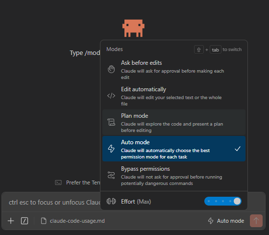
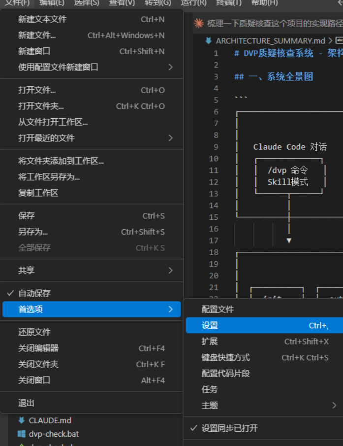
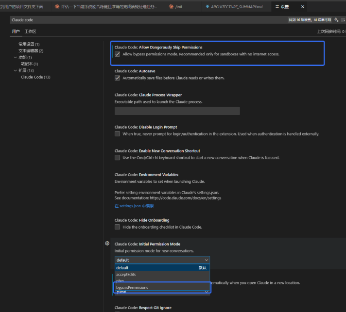
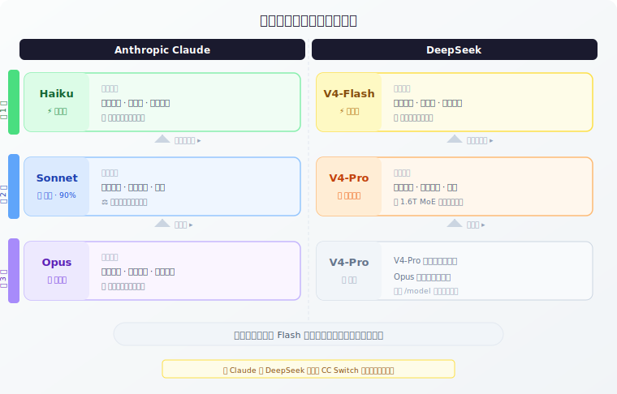
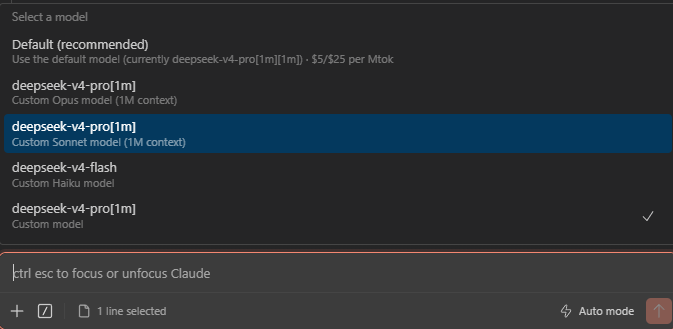
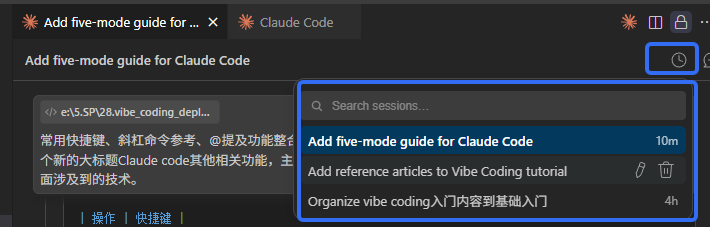
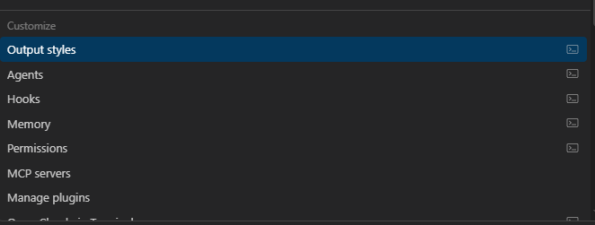

# Claude Code 使用指南

[Claude Code](https://code.claude.com/) 是 Anthropic 推出的 AI 编程助手。本指南聚焦于 **VS Code 扩展**的使用方式，帮助你环境搭建后快速上手。

## 五种工作模式

Claude Code 提供五种工作模式，通过 `Shift+Tab` 循环切换，适应从"谨慎审查"到"全自动运行"的不同场景：


| 模式 | 行为 | 适用场景 |
|------|------|----------|
| **Ask before edits** | Claude 在每次编辑前都会请求批准 |适合需要严格控制修改内容的场景 |
| **Edit automatically** | Claude 直接编辑你选中的文本或整个文件 | 不需要逐个确认 |
| **Plan mode** | Claude 会先探索代码并给出修改计划 | 计划通过后才会执行编辑 |
| **Auto mode** | Claude 自动选择最适合当前任务的权限模式 | 平衡效率与安全性 |
| **Bypass permissions** | Claude 自动执行所有任务，不会再请求批准 | 适合高信任度或自动化场景（需谨慎使用） |




### 开启Bypass permissions模式
**这个模式有安全风险！！！** 开放权限后，类似于Openclaw龙虾！请谨慎使用！
1. 打开 VS Code 左上角File->首选项->设置 

2. 搜索 Claude Code

3. 找到并勾选Claude Code: Allow Dangerously Skip Permissions
4. 设置 Claude Code: Initial Permission Mode 为 bypassPermissions

## 模型切换策略

> **为什么有些问题秒回，有些要想很久？** 同样是问 AI，"1+1=?"和"帮我设计数据库 Schema"的耗时天差地别。

Claude Code 配合 CC Switch 插件可接入多套模型供应商（如 Anthropic Claude、DeepSeek 等）。不同模型各有所长，选择策略就像**医院分诊台**一样——感冒去全科，手术进专家号。


### 多模型分工与调度


> **核心原则**：先用轻量模型（Haiku / V4-Flash）试，搞不定了再升级到主力模型（Sonnet / V4-Pro）。Opus 级别的复杂任务留给专家模型处理。


### 实操指南

| 操作 | 命令 | 说明 |
|------|------|------|
| 查看当前模型 | `/model` | 显示当前使用的模型 |
| 切换模型 | `/model` 后在列表中选择 | 支持 Claude Haiku / Sonnet / Opus、DeepSeek V4-Pro 等 |




## 常用操作速查

Claude Code 提供 CLI 和 VS Code 扩展两种使用方式，功能支持略有差异：

| 功能 | CLI | VS Code 扩展程序 |
|------|-----|-----------------|
| 命令和技能 (Commands and skills) | 全部支持 | 部分支持 |
| MCP 服务器配置 | 支持 | 部分支持 |
| 检查点 (Checkpoints) | 支持 | 支持 |
| ! Bash 快捷指令 | 支持 | 不支持 |
| Tab 自动补全 | 支持 | 不支持 |

### 斜杠命令参考

#### 会话管理

| 命令 | 功能 |
|------|------|
| `/clear` | 清除对话历史 |
| `/compact` | 压缩对话（释放上下文空间） |
| `/rename` | 重命名当前会话 |
| `/resume` | 恢复已保存的会话 |
| `/export` | 导出对话记录 |
| `/copy` | 复制对话到剪贴板 |



#### 代码操作

| 命令 | 功能 |
|------|------|
| `/plan` | cli命令，进入计划模式，先设计方案再执行 |
| `/review` | 对当前更改进行代码审查 |
| `/rewind` | 回滚对话和/或代码更改至之前状态 |
| `/init` | 初始化项目 CLAUDE.md 文件 |
| `fork conversation from here` | 从当前对话中开辟出一个新会话 |
| `Rewindc code to here` | 回滚到当前对话 |
| `fork conversation and Rewindc code` | 从当前对话中开辟出一个新会话并回滚代码|


#### 工具

| 命令 | 功能 |
|------|------|
| `/mcp` | 管理 MCP 服务器 |
| `/plugins` | 管理插件 |
| `/agents` | 管理自定义子 Agent |
| `/memory` | 编辑 CLAUDE.md 记忆文件 |



#### 信息查看

| 命令 | 功能 |
|------|------|
| `/help` | 获取使用帮助 |
| `/config` | 打开设置界面 |
| `/context` | 可视化当前上下文使用情况 |
| `/cost` | 显示 token 使用量和费用 |
| `/usage` | 显示用量详细分解 |
| `/stats` | 使用统计可视化 |
| `/debug` | 诊断常见问题 |
| `/doctor` | 环境健康检查 |


### @提及功能

在对话输入框中使用 `@` 可以快速引用上下文：

| 提及 | 功能 |
|------|------|
| `@file` | 引用特定文件 |
| `@folder` | 引用整个文件夹 |
| `@git` | 引用 Git 变更 |
| `@terminal` | 引用终端输出 |
| `@rules` | 引用项目规则文件 |

> 快捷键 `Alt+K` 可快速插入 `@file:行号` 引用。

### 自定义斜杠命令

在项目中创建 `.claude/commands/` 目录，添加 markdown 文件即可定义自定义命令：

```
.claude/commands/
├── deploy.md      # /deploy 命令
├── test.md        # /test 命令
└── format.md      # /format 命令
```

命令文件支持 Markdown 格式，可包含提示词模板和参数占位符。

## Claude Code 其他相关功能

除了上述日常操作，Claude Code 还提供一系列进阶能力，帮助你在复杂项目中更高效地协作。这也是Context Coding（上下文编程）的相关能力。

#### CLAUDE.md 记忆系统

CLAUDE.md 是项目的"说明书"——你可以在此文件中定义项目结构、编码规范、关键约定，Claude 在每个会话中会自动加载这些信息，确保行为一致。

- 使用 `/init` 一键生成项目初始 CLAUDE.md
- 使用 `/memory` 随时编辑和补充项目记忆
- 支持分层配置：`CLAUDE.md`（项目级）→ `~/.claude/CLAUDE.md`（用户级）

> 参考：[Claude Memory 机制深入](https://code.claude.com/docs/en/memory)

#### Skills 技能系统

Skills 是可复用的专项能力包，社区已提供丰富的预制技能——PPT 生成、PDF 处理、前端设计、数据分析等。通过 `/plugins` 安装后即可在对话中触发。

- [Claude Code Skills 市场](https://lobehub.com/skills/) — 浏览和安装社区技能
- 支持自定义技能，封装团队专属工作流

#### Hooks 生命周期自动化

Hooks 允许你在 Claude Code 的关键生命周期节点（如工具调用前后、会话启动、提交前）自动执行自定义脚本，实现代码审查门禁、自动格式化、安全扫描等流水线能力。

| Hook 类型 | 触发时机 |
|-----------|----------|
| `PreToolUse` | 工具执行**前**，可拦截并修改参数 |
| `PostToolUse` | 工具执行**后**，可检查结果 |
| `Notification` | 会话事件通知（如权限请求） |
| `Stop` | 会话结束时触发 |

> 参考：[Claude Code Hooks 指南](https://code.claude.com/docs/en/hooks)

#### 子 Agent 并行工作

Claude Code 支持派生多个子 Agent 同时处理不同任务，互不干扰——比如一个 Agent 搜索代码，另一个 Agent 编写文档。子 Agent 拥有独立上下文，避免主会话拥挤。

- `/agents` 管理自定义子 Agent
- 子 Agent 可指定模型、权限模式、工作目录
- 适合代码探索、批量审查、多文件重构等并行场景


#### MCP 服务器集成

Model Context Protocol（MCP）是连接 Claude 与外部工具和数据源的开放协议。通过 MCP 服务器，Claude 可以访问数据库、API、文件系统等外部资源。

- `/mcp` 管理 MCP 服务器配置
- 社区已提供数百个现成的 MCP 服务器（Jira、Slack、GitHub、数据库等）
- 支持自定义 MCP 服务器，一次开发处处使用

> 参考：[Model Context Protocol](https://modelcontextprotocol.io/)


## 参考文章

#### 官方资源

| 文章 | 来源 | 说明 |
|------|------|------|
| [Claude Code 官方文档](https://code.claude.com/docs/en/overview) | Anthropic | 安装、配置、斜杠命令、CLAUDE.md 编写等完整功能说明 |
| [Claude Code Power User Tips](https://support.claude.com/en/articles/14554000-claude-code-power-user-tips) | Anthropic 官方 Help Center | 官方推荐的进阶技巧：并行工作区、子 Agent 隔离、Hooks、MCP 集成 |
| [Claude Code 更新日志](https://code.claude.com/docs/en/changelog) | Anthropic | 每次版本更新的功能变化与 bug 修复记录 |
| [Claude Code 定价](https://claude.com/pricing) | Anthropic | Pro / Max / Team / Enterprise 订阅方案对比 |

#### 社区最佳实践

| 文章 | 来源 | 说明 |
|------|------|------|
| [Claude Code Best Practices](https://github.com/muhammadusmanGM/claude-code-best-practices) | 社区 GitHub 仓库 | 30+ 篇实用指南：CLAUDE.md 模板、多 Agent 模式、成本优化、安全清单 |
| [Claude Code Best Practices 2026](https://www.morphllm.com/claude-code-best-practices) | Morph | 从"80% 问题"到双矫正规则、WarpGrep 子 Agent、Token 经济学 |
| [Claude Code Ultimate Guide](https://github.com/FlorianBruniaux/claude-code-ultimate-guide) | GitHub 社区 | ~20,000 行参考手册：涵盖速查表、安全加固、沙盒配置、Mermaid 图表 |
| [Claude Code: The Complete Handbook](https://www.lunartech.ai/blog/claude-code-the-complete-handbook) | LUNARTECH, 2026.02 | 从 Anthropic 安全哲学到 Token 经济学的入门到精通手册 |
| [Claude Code 最佳实践经验总结](https://mp.weixin.qq.com/s?__biz=Mzg2NTA4MTAwMQ==&mid=2247483721&idx=1&sn=700e794e44e169beeb8e27f239bfa5b0) | 微信公众号 | 从 Vibe Coding 到 AI-Native 开发的中文实践指南 |

#### 工具与生态

| 文章 | 来源 | 说明 |
|------|------|------|
| [CC Switch](https://github.com/farion1231/cc-switch) | GitHub 开源 | 50+ Provider 一键切换、MCP 管理、用量追踪、自动故障转移 |
| [Claude Code Skills 市场](https://lobehub.com/skills/) | 社区 | 可复用的 Claude Code Skills 分享与安装平台 |
| [Claude Memory 机制深入](https://code.claude.com/docs/en/memory) | Anthropic 官方 | CLAUDE.md 记忆体系、自动记忆与项目规则的配置方法 |

#### 进阶主题

| 文章 | 来源 | 说明 |
|------|------|------|
| [Claude Agent SDK](https://claude.dev/) | Anthropic 官方 | 构建自定义 AI Agent 的开发工具包 |
| [Model Context Protocol (MCP)](https://modelcontextprotocol.io/) | Anthropic 开源 | 连接 AI 与外部工具/数据源的开放协议标准 |
| [Claude Code Hooks 指南](https://code.claude.com/docs/en/hooks) | Anthropic 官方 | 生命周期事件自动化：PreToolUse、PostToolUse、通知等
