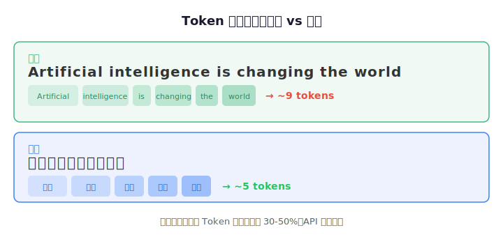
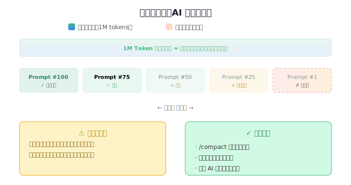
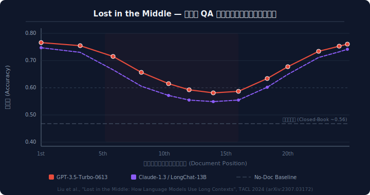
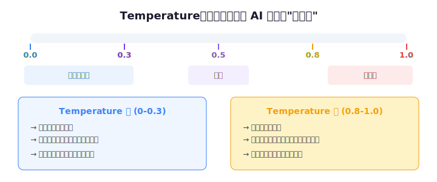
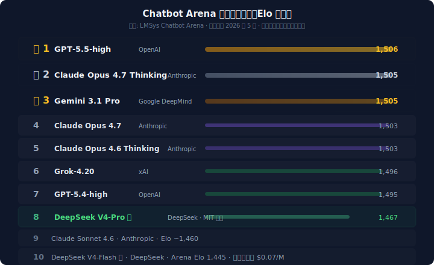

# LLM 基础概念

**LLM**（Large Language Model，大语言模型）是基于海量文本数据训练的深度学习模型。理解它的基本概念，你才能知道为什么 AI 有时聪明有时笨、为什么聊久了会"失忆"、以及怎样用最少的钱拿到最好的效果。

本次培训你将使用 **DeepSeek V4** 模型，所以每个概念都会结合它来讲解。

## 核心概念

### Token（词元）

> **为什么 AI 按 Token 收费？** 用 AI 编程时，你有没有想过——同样一句话，中文与英文哪个更便宜？

模型不数字数，它数 **Token**。

Token 是 LLM 处理文本的最小单位。它不是"一个字"，也不是"一个单词"，而是分词器切出来的最小片段：

| 语言 | Token 换算（大致） | 单词示例 |
|------|-------------------|----------|
| 英文 | 1 token ≈ 0.75 个单词 | `"AI"` → 1 token（高频缩写，不分词） |
| 中文 | 1 token ≈ 1.5 个汉字 | `"人工智能"` → 约 2 tokens |

那为什么同样一句话，中文可能比英文便宜？关键在于**语法密度**——中文没有冠词（a/the）、不需要介词填充、动词不随人称变形，表达相同意思用的词更少：

> **对你意味着什么**：DeepSeek V4 Pro 输入（缓存命中）0.025元/百万 token，输入（缓存未命中）3元/百万 token，输出6元/百万 token。一次完整的 Vibe Coding 对话（含代码上下文）通常消耗几千到几万 token，单次成本在几分钱到几毛钱之间。

### 参数（Parameters）

> **为什么大模型比小模型聪明？** 7B、70B、1.6T……这些数字到底代表什么？是不是参数越大模型越强？

参数是模型在训练中学习到的**数值权重**，决定了模型的"知识容量"。你可以把参数想象成神经元的连接数——连接越多，理论上能存储和表达的知识越丰富。

| 规模 | 参数量 | 典型模型 | 运行要求 |
|------|--------|----------|----------|
| 小模型 | 1B–9B | Qwen 7B, Llama 3.2 3B | 消费级 GPU / 本地运行 |
| 中等模型 | 10B–70B | Gemma 4 31B | 高端 GPU / 云端推理 |
| 大模型 | 100B–1.6T | GPT-5.5, Claude Opus 4.6, DeepSeek V4 | 云端推理集群 |

### 上下文窗口（Context Window）
> **为什么聊着聊着 AI 就变笨了？** 你一定经历过——对话开头 AI 还记得你的需求，但几百行之后它开始答非所问、忘掉之前说好的规则，甚至反复建议你改已经改过的东西。这不是它"不认真"，而是它**装不下了**。

上下文窗口是模型一次能处理的 token 总量上限，相当于 AI 的"短期记忆"。它包含你输入的所有 prompt + AI 输出的所有内容，一旦超限，最早的消息就会被"遗忘"。

**DeepSeek V4 支持 1M token 上下文窗口**，这意味着你可以在一次对话中放入整个代码仓库 + 全量文档 + 几十轮历史对话，它都能记住。但即使有 1M 窗口，模型并不是均匀地"记住"所有内容。研究发现，**模型对上下文开头和结尾的信息回忆最准，对中间部分的信息则明显遗忘**——这就是经典的 **"Lost in the Middle"** 现象：

对话越长，模型对早期信息的**注意力越分散**——就像你读完一本书后，对开头细节的记忆肯定不如刚读时清晰。

#### 解决注意力分散的方法

应对 Lost in the Middle 有三条核心策略，按投入产出比排序：

**① 把最重要的规则写进 `CLAUDE.md`（收益最高）**

理解了 U 型曲线的"开头优势"，你就能明白 **CLAUDE.md 是整个 Vibe Coding 工作流中最值得投入时间的文件**。

Claude Code 在每次对话开始时，会静默地将项目根目录的 `CLAUDE.md` 内容注入到上下文的**最开头**——恰恰落在模型注意力最强、召回率最高的"黄金位置"：

| 位置 | 注意力 | 示例内容 |
|------|--------|----------|
| **开头（高召回区）** | 最强 | `CLAUDE.md` 项目规则、技术栈、编码规范 |
| 中间（低召回区） | 最弱 | 早期对话历史、中间轮次的代码变更 |
| **结尾（高召回区）** | 很强 | 当前任务指令、最新代码 diff |

> 把最重要的规则写进 `CLAUDE.md`，而不是在对话中间反复提醒——中间位置的指令很快就会被模型"遗忘"。用 `/init` 或 `/memory` 命令可以快速创建和编辑项目的 CLAUDE.md 文件。

**② 及时 `/compact` 压缩对话（日常维护）**

当对话变长后，中间堆积的历史消息会稀释模型对关键信息的注意力。`/compact` 命令会将现有对话压缩为一份摘要，释放上下文空间的同时把项目规则保留在开头，让模型重新聚焦。**感到 AI "变笨"时，先 `/compact` 再继续。**

**③ 一个对话只做一件事（源头控制）**

不要在同一个对话里塞太多不相关的任务。新功能开新会话，新 bug 新会话。**长上下文不是可以挥霍的理由——窗口再大，中间位置的信息依然会被遗忘。**

### 采样参数（Temperature / Top-p）

> **为什么有时 AI 一板一眼，有时天马行空？** 同样一个问题，你问两次，AI 给出的答案可能完全不一样。有时候你希望它确定（比如写代码），有时候你希望它有创意（比如起名字）。怎么控制？

模型生成下一个 token 时不是"选最可能的那个"，而是**从一个概率分布中采样**。以下参数控制采样的"随机程度"：

| 参数 | 含义 | 低值效果 | 高值效果 |
|------|------|----------|----------|
| **Temperature** | 采样的随机程度 | 0–0.3：每次回答几乎一样，适合代码 | 0.8–1.0：每次回答不同，适合创意 |
| **Top-p** | 核采样——只从累积概率 ≥ p 的候选词中选 | 0.1：只选最可能的少数词 | 0.95：考虑更多可能性 |
| **Max Tokens** | 单次输出上限 | 限制短的回复 | 允许长输出 |

> DeepSeek V4 的 `Think` 模式下，模型内部会走推理链——采样参数对推理过程的控制和你直观感受到的不太一样。简单理解：**写代码时 Temperature 调低，头脑风暴时 Temperature 调高。**

## 主流模型对比

| 模型 | 开发商 | 总参数 | 上下文 | 输入 | 输出 | 定位 |
|------|--------|--------|--------|------|------|------|
| [**DeepSeek V4 Pro**](https://api-docs.deepseek.com/) 🟢 | DeepSeek | 1.6T (49B) | 1M | $1.74 | $3.48 | 前沿能力 + MIT 开源 |
| [**DeepSeek V4 Flash**](https://api-docs.deepseek.com/) 🟢 | DeepSeek | 284B (13B) | 1M | **$0.14** | **$0.28** | 极致性价比 |
| [**Kimi K2.6**](https://platform.moonshot.cn/) | Moonshot | 1T (32B) | 262K | $0.60 | $2.50 | Agent 集群 + 开源 |
| [**GLM-5**](https://z.ai/) | 智谱 | 744B (40B) | 200K | $1.00 | $3.20 | 国产开源旗舰 |
| [**MiniMax-01**](https://www.minimax.io/) | MiniMax | 456B (46B) | **4M** | $0.20 | $1.10 | 超长上下文 + 开源 |
| [**Qwen3.5-Plus**](https://help.aliyun.com/zh/model-studio/) | 阿里 | ~1T+ | 1M | $0.12 | $0.69 | 中文优化 |
| [**Claude Opus 4.7**](https://docs.anthropic.com/en/docs/about-claude/models) | Anthropic | ~1T+ | 1M | $5.00 | $25.00 | 最强编码推理 |
| [**Claude Sonnet 4.6**](https://docs.anthropic.com/en/docs/about-claude/models) | Anthropic | ~400B | 1M | $3.00 | $15.00 | 旗舰性价比 |
| [**GPT-5.5**](https://platform.openai.com/docs/models) | OpenAI | ~1T+ | 1M | $5.00 | $30.00 | 前沿编码 + 低幻觉 |
| [**Gemini 2.5 Pro**](https://ai.google.dev/gemini-api/docs/models) | Google | ~1T+ | 1M | $1.25 | $10.00 | 多模态 + 长上下文 |

> **本次培训使用 DeepSeek V4**，建议日常开发默认用 Flash 模式（速度快、成本低），遇到复杂问题再用 Pro + Think Max 深度推理。使用 [CC Switch](/deploy/cc-switch) 可一站式管理 50+ 模型服务商。

## 参考文章

#### 基础原理

| 文章 | 来源 | 说明 |
|------|------|------|
| [Attention Is All You Need](https://arxiv.org/abs/1706.03762) | Vaswani et al., NeurIPS 2017 | Transformer 架构奠基论文，理解 LLM 必读 |
| [Lost in the Middle: How Language Models Use Long Contexts](https://arxiv.org/abs/2307.03172) | Liu et al., TACL 2024 | 揭示上下文窗口 U 型注意力曲线的经典研究 |
| [Found in the Middle](https://nips.cc/virtual/2024/poster/94207) | Zhang et al., NeurIPS 2024 | Lost in the Middle 的改进方案——插拔式多尺度位置编码 |
| [What is Temperature in NLP?](https://lukesalamone.github.io/posts/what-is-temperature/) | Luke Salamone | 用可视化交互实验直观解释 Temperature 参数 |
| [LLM Visualization](https://bbycroft.net/llm) | Brendan Bycroft | 3D 交互式 LLM 架构可视化，从嵌入到输出的完整推演 |

#### 模型与技术报告

| 文章 | 来源 | 说明 |
|------|------|------|
| [DeepSeek-V4 技术报告](https://huggingface.co/blog/deepseekv4) | DeepSeek AI, 2026.04 | 1.6T MoE 架构详解：CSA/HCA 混合注意力、Muon 优化器、FP4 QAT |
| [LLM Leaderboard](https://lmarena.ai/) | LMSYS/Chatbot Arena | 社区众评的模型排行榜，Elo 评分机制 |

#### 工具与动手实验

| 文章 | 来源 | 说明 |
|------|------|------|
| [OpenAI Tokenizer](https://platform.openai.com/tokenizer) | OpenAI | 在线分词演示，直观感受中英文 Token 切分差异 |
| [nanoGPT](https://github.com/karpathy/nanoGPT) | Andrej Karpathy | ~300 行 PyTorch 实现的 GPT-2 训练代码，学习 LLM 原理的最佳实践项目 |
