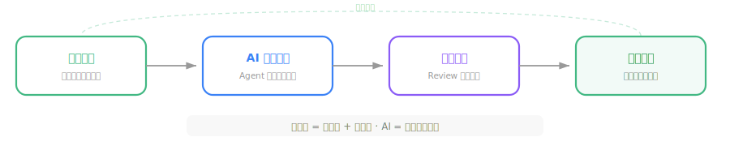
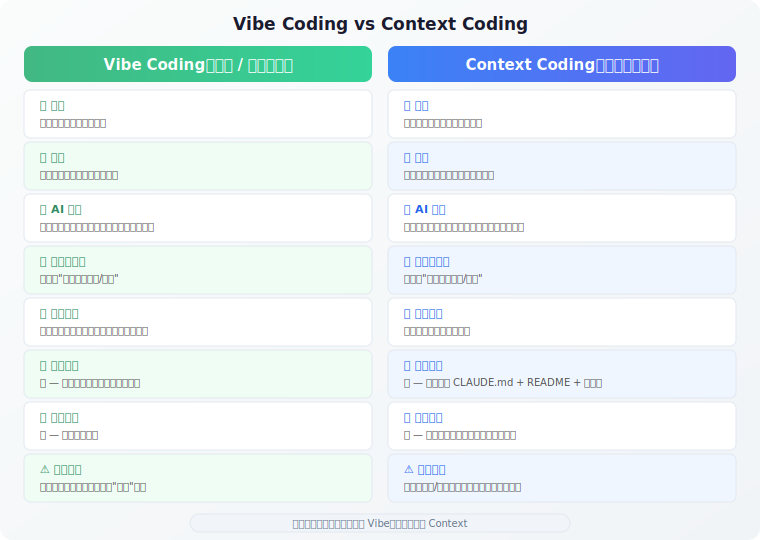
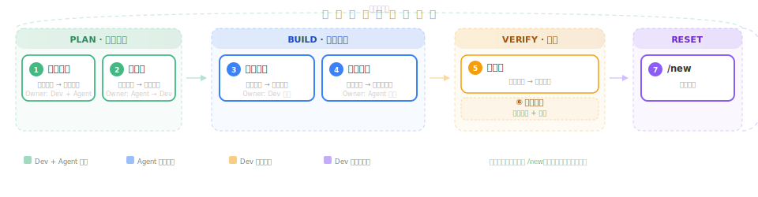
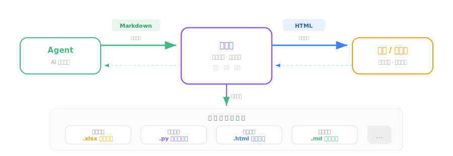

# Vibe Coding 相关理念

**Vibe Coding**（氛围编程）由 [Andrej Karpathy](https://x.com/karpathy)在 **2025 年 2 月** 提出，是一种以 AI 为核心驱动力的现代编程范式——开发者通过**自然语言描述意图**，由 AI 助手完成代码生成、编辑与调试，将精力聚焦于设计思路而非实现细节。

## Vibe Coding核心理念

Vibe Coding 的精髓在于**从"写代码"转向"描述意图"**：

不同于传统编程的逐行编写，Vibe Coding 将 AI 视为协作伙伴，开发者扮演"架构师 + 审查者"角色：

### Vibe Coding 能完成的任务

从数据处理到应用交付，Vibe Coding 覆盖了多种常见的开发任务场景：

- **数据清洗与报表生成** — 读取 CSV/Excel，按规则清洗、聚合统计，输出可直接交付的报表文件
- **自动化脚本开发** — 文件批处理、API 数据抓取、定时任务等，封装为一键运行的 Python 脚本
- **交互式工具与看板** — 用 HTML 构建可视化操作界面，拖拽排序、参数调节，浏览器打开即用
- **原型快速搭建** — 从想法到可交互 Demo，一个对话就能跑起来的完整应用骨架
- **API 开发与集成** — 对接第三方服务、编写 RESTful 接口、处理鉴权与数据格式转换
- **技术文档整理** — 将对话中的技术方案沉淀为结构化文档、知识库条目或团队 Wiki

### Vibe Coding的发展

随着实践深入，社区分化出两种流派：

实践中，成熟的 Vibe Coding 工作流往往结合两者——搭建阶段用 Vibe，打磨阶段用 Context。

## 理想实战工作流

成熟的工作流遵循一个固定节奏，每一步都有明确的职责和验证标准：

### 1. 读上下文：别一上来就写代码

尤其是接触陌生项目、论文复现、接手他人代码时，第一步永远是让 AI 先读懂项目，而不是立刻动手：

> "先不要修改代码。请先阅读这个项目，告诉我：项目结构、主要入口在哪里、运行命令是什么、哪些文件最可能和当前任务有关、你不确定的地方有哪些。"

**Claude Code 操作：**

| 操作 | 作用 |
|------|------|
| `@folder` | 将整个项目目录注入上下文，让 AI 一次性感知项目全貌 |
| `@file` | 引用特定文件，精准告诉 AI "先从这里开始读" |
| 子 Agent 探索 | 派一个只读 Agent 去搜索代码，结果返回主会话，避免污染上下文 |
| `/clear` | 读完后清空上下文再开始新任务，避免读完的信息占用后续空间 |

这一步看起来慢，其实最省时间——很多翻车都是因为 AI 一开始就带着错误假设开干，后面越改越乱。

### 2. 写计划：复杂任务先 Plan

只要任务跨文件，就应先让 AI 出计划，确认方向后再动手：

> "先不要写代码。请进入计划模式，帮我设计实现方案：明确要解决的问题、列出影响哪些模块、拆成 3-7 个步骤、每步怎么验证、哪些地方最容易出错。等我确认后再开始。"

**Claude Code 操作：**

| 操作 | 作用 |
|------|------|
| `Shift+Tab` | 循环切换到**计划模式**（🔍 图标），AI 只读不写，安全探索 |
| `plan mode` | 直接进入计划模式，AI 先设计方案再等你确认 |
| 计划确认后再切模式 | 方案审查通过后，`Shift+Tab` 切回编辑模式开始实现 |

这样做的好处是提前发现 AI 有没有理解错需求。很多时候，计划本身比代码更有价值。

### 3. 小步实现：一次只做一个关注点

- 一次只描述一个功能，避免信息过载
- 先让 AI 输出思路，方向确认后再生成代码
- **只做与当前任务相关的最小改动**，不碰无关文件
- 禁止修改没有列在计划中的文件

**Claude Code 操作：**

| 操作 | 作用 |
|------|------|
| 编辑模式（✏️） | 默认模式，AI 每步修改都需要你审批，保持完全控制 |
| 自动接受（⚡） | 信任度高的文件编辑自动应用，大幅提速 |
| `Alt+K或者手动选择` | 插入 `@file:行号`，精准告诉 AI 改哪里 |
| `/rewind` | 改坏了？一键回滚对话和代码到之前的状态 |

### 4. 跑验证：不要相信"完成了"

每次任务结束都要求 AI 给出明确的验收清单：

> "请最后给我：修改了哪些文件、每个文件为什么改、运行了哪些验证、还有哪些没验证、哪些地方需要我人工确认。"

**Claude Code 操作：**

| 操作 | 作用 |
|------|------|
| `/review` | 让 AI 对当前变更做代码审查，检查安全、逻辑、风格问题 |
| `/context` | 检查上下文使用百分比，确认没有因装不下而丢失信息 |
| `/cost` | 查看本次会话 token 消耗和费用，评估性价比 |
| Hooks（PreToolUse） | 配置自动化 Hook，提交前强制运行 lint/test |

没跑过验证的代码，就当它没写完。

### 5. 总结 + 开新会话

长会话会悄悄积累旧假设。前一个任务残留的判断会在你不注意的时候污染下一个任务。完成一个任务后：

> "请用一句话总结刚完成的任务、修改过的文件、当前状态和下一步注意事项。"

**Claude Code 操作：**

| 操作 | 作用 |
|------|------|
| `/compact` | 压缩对话摘要，释放上下文但不丢失关键信息 |
| `/new conversation` | 新建对话，开始下一个任务 |
| `/resume` | 恢复之前保存的对话，随时捡起中断的任务 |

然后在新会话中贴入上一步的总结，再开始下一个任务。这个动作很小，效果很明显。

## Vibe Coding 信息流通方式

在 Vibe Coding 的长期探索中，我们发现AI阅读习惯与人类的阅读习惯并不一致。

### Agent与开发者：Markdown 沟通

Agent 输出代码方案、技术分析、变更说明——目标读者是**懂代码的开发者**，用 Markdown 沟通最高效：

- 线性结构扫一眼就能判断方向对不对
- 开发者通过 CLAUDE.md、规则文件、prompt 反向驱动 Agent
- Git diff 清晰，直接纳入代码仓库长期维护

### 开发者与需求方：HTML 沟通

用户看不懂代码，也不需要看。并且markdown输出了太多的内容，不利于需求方阅读。开发者用 HTML 将技术信息转化为**可视化交互界面**，让用户参与对齐和决策：

- **方案对比页**：分栏、折叠、颜色标记——用户不读代码也能对比选择
- 用户在浏览器验收，减少"你做的和我想的不一样"

## 参考文章

#### Vibe Coding 的起源与演进

| 文章 | 来源 | 说明 |
|------|------|------|
| [Vibe Coding 原始推文](https://x.com/karpathy/status/1886192544808792320) | Andrej Karpathy, 2025.02 | "Not really coding…just seeing stuff, saying stuff, running stuff"——术语的发源地 |
| [Vibe Coding 终结，"智能体工程"时代开启](https://www.36kr.com/p/3670333435798402) | 新智元/36Kr, 2026.02 | Karpathy 宣告 Vibe Coding 进化到 Agentic Engineering，99% 代码由 AI Agent 完成 |
| [Karpathy Sequoia AI Ascent 2026 深度解读](https://www.53ai.com/news/LargeLanguageModel/2026043026804.html) | 53AI/宝玉, 2026.04 | Software 3.0 框架、"锯齿智能"、MenuGen 案例——最全面的一手访谈分析 |
| [Ex-Tesla AI Head Sees "Phase Shift" in Software Engineering](https://www.businessinsider.com/andrej-karpathy-claude-code-manual-skills-atrophy-software-engineering-tesla-2026-1) | Business Insider, 2026.01 | Karpathy 自述 80% 代码已交给 AI，手工程序技能"正在萎缩" |
| [Karpathy：代码正在消失，Software 3.0 来了](https://zhuanlan.zhihu.com/p/2033939735152997737) | 知乎, 2026.05 | 中文读者友好的 Sequoia 访谈解读，附"可验证性决定 AI 能做什么"的深刻洞察 |

#### AI 输出格式之争：HTML vs Markdown

| 文章 | 来源 | 说明 |
|------|------|------|
| [The Unreasonable Effectiveness of HTML](https://simonwillison.net/2026/may/8/unreasonable-effectiveness-of-html/) | Simon Willison 推荐 + Thariq Shihipar 原文, 2025.05 | X 平台 780 万阅读的现象级文章——AI 输出为什么应该从 Markdown 转向 HTML |
| [HTML 交互范例库](https://thariqs.github.io/html-effectiveness/) | Thariq Shihipar | 20 个开源 HTML 交互范例：PR 审查、看板排序、Prompt 调试面板 |
| [Claude Code 工程师：HTML 是新的 Markdown](https://www.koc.com.tw/archives/642090) | 电脑王阿达, 2026.05 | 中文编译解读，覆盖五大实用场景和社区反应 |

#### 行业数据与调查报告

| 文章 | 来源 | 说明 |
|------|------|------|
| [GitHub Octoverse 2025](https://github.blog/news-insights/octoverse/octoverse-a-new-developer-joins-github-every-second-as-ai-leads-typescript-to-1/) | GitHub 官方, 2025.10 | 92% 开发者使用 AI 工具、46% 新代码由 AI 生成、TypeScript 超越 Python 成为第一大语言 |
| [Octoverse 2025 中文解读](https://mp.weixin.qq.com/s?__biz=MzYzODAyMTkyOA==&mid=2247483805&idx=1&sn=055d4b38a65087e0244b0584c3628f87) | 微信公众号, 2025.10 | 四大趋势重塑编程世界的中文精读 |
| [The State of AI in Software Engineering](https://www.lennysnewsletter.com/p/the-state-of-ai-in-software-engineering) | Lenny's Newsletter / Addy Osmani, 2025 | Google 工程总监的 AI 编程工作流框架与实践总结 |

#### 工具生态

| 文章 | 来源 | 说明 |
|------|------|------|
| [Claude Code 官方文档](https://code.claude.com/docs/en/overview) | Anthropic | Claude Code 功能概览、安装指南与常见问题 |
| [Cursor 官方文档](https://docs.cursor.com/) | Cursor | AI-first IDE 的完整使用指南 |
| [Aider 官方文档](https://aider.chat/) | Aider 社区 | 终端 AI 结对编程工具，支持 100+ LLM 后端 |
| [GitHub Copilot 文档](https://docs.github.com/copilot) | GitHub | Copilot 代码补全、Chat、Agent 模式全功能说明
