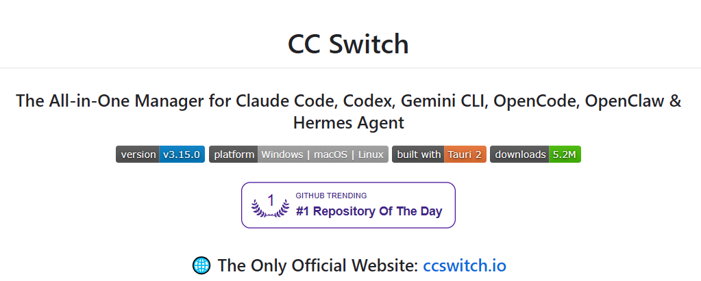
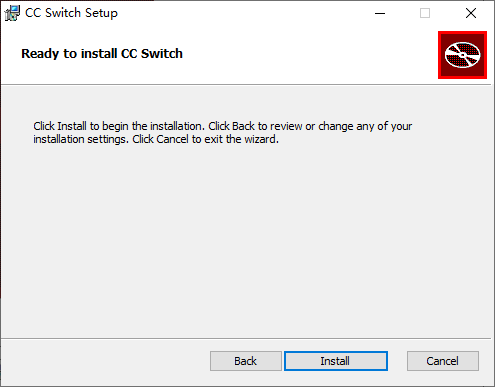
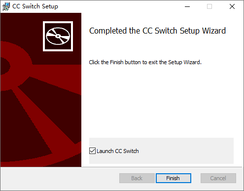

# CC Switch

[CC Switch](https://github.com/farion1231/cc-switch) 提供了一站式桌面应用，轻松掌控 AI CLI 工具。无需再手动修改繁琐的配置文件，只需通过直观的图形界面，即可一键导入服务商、秒级无缝切换。应用内置 50 多种主流服务商预设，支持统一的 MCP 与 Skills 管理以及系统托盘一键闪切——其底层更是由可靠的 SQLite 数据库保驾护航，通过原子写入机制，彻底杜绝配置损坏的风险。

## 官方网站

## 安装步骤

1. 从官方网站下载，或使用附件 `CC-Switch-<version>-Windows.msi` 安装并点击 `Next`

2. 选择安装路径并点击 `Next`

3. 并点击 `Install`

4. 等待安装完成，点击 `Finish`

## 配置第三方模型

本教程选用 DeepSeek-v4 模型

1. [DeepSeek 开放平台](https://platform.deepseek.com/sign_in) 注册并充值

2. 创建 API Key

3. 复制 API Key（注意：只显示一次，如果遗忘需要重新创建）

4. 打开 CC Switch，点击右上角 `+`

5. 点击 `Claude 供应商`

6. 向下滚动，填写刚才复制的 `API Key`

7. 参考下图填写 `模型映射` 和 `默认兜底模型`，最后点击 `添加`

## 下一步

配置完成后，请前往[验证第三方模型接入](/deploy/verify-third-party-model)确认模型是否已正确切换。
