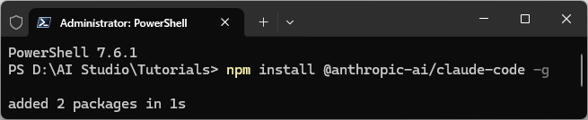
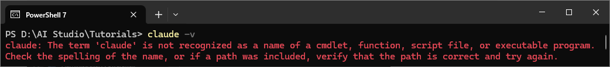
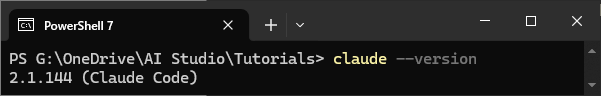

# Claude Code - 终端 CLI

[Claude Code](https://code.claude.com/docs/en/overview) 是一款 AI 编程助手，能够理解代码库、编辑文件、运行命令、构建新功能、修复 Bug 等。这里安装的是它的 **CLI（Command-Line Interface，命令行界面）** 版本 —— 与依赖鼠标操作的图形界面软件不同，CLI 工具完全在终端中运行，通过键盘输入文本命令与计算机交互。当你于终端键入 `claude` 后，它会进入 **TUI（Text-based User Interface，基于文本的用户界面）** 模式，用字符排版模拟出类似聊天软件的窗口（包含状态栏、对话区、底部的输入框等）。


## 官方网站


## 安装步骤

选择以下任一方法安装 Claude Code：

### 特殊网络环境允许时，优先使用官方安装方法

```powershell
irm https://claude.ai/install.ps1 | iex
```

### 特殊网络环境不允许时，推荐使用 npm 安装

1. 自动从 npm 官方仓库拉取适配当前操作系统的最新版本 claude-code 包

```powershell
npm install @anthropic-ai/claude-code -g
```



2. 参考下方验证小节，如见下图提示，重新打开终端并再次尝试；如仍然报错，则继续下方步骤



**！！！以下步骤仅验证失败时进行！！！**

通常情况下，运行 `npm install @anthropic-ai/claude-code -g` 时，npm 会自动生成启动脚本 `claude.ps1`，这样才能在终端直接敲命令：

1. 终端输入 `npm config get prefix`，获取 npm 全局可执行脚本路径，打开对应文件夹
2. 如果存在 `claude.ps1`，则路径可能未成功配置到用户环境变量，需手动添加
3. 如果不存在，终端输入 `npm root -g`，获取 npm 全局安装包根路径，打开对应文件夹，依次打开子文件夹 @anthropic-ai、claude-code、bin，可见 `claude.exe` 文件，将当前文件夹路径手动添加至用户环境变量

环境变量添加方法参考 [常见问题解答](/deploy/faq#q5-如何编辑用户环境变量)。

## 验证

1. `Win + R` 输入 `wt` 打开 Windows Terminal
2. 终端输入命令 `claude --version`
3. 如下图，正常显示版本号则安装成功


