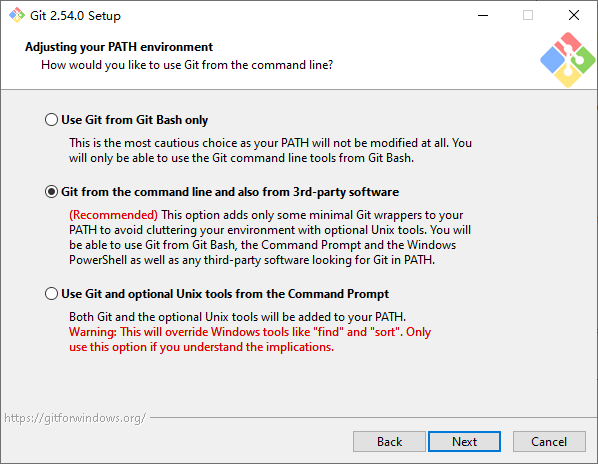
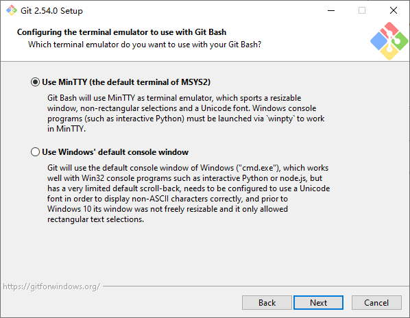
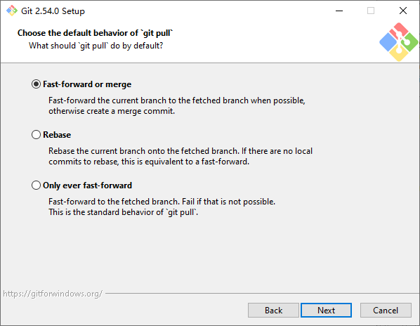
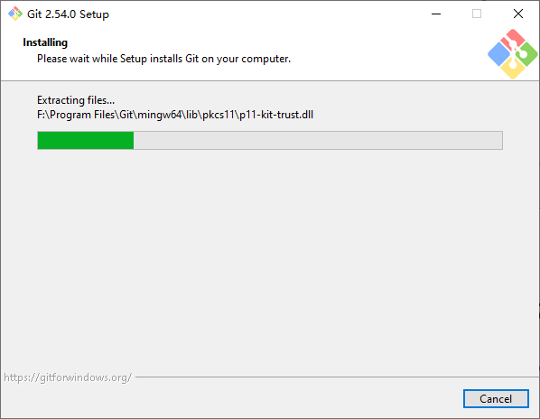
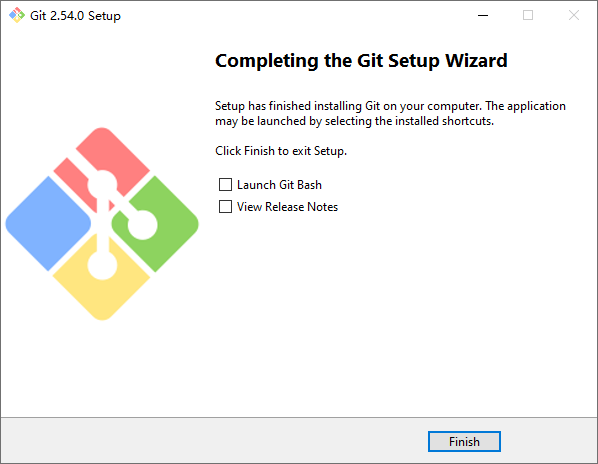

# Git

[Git](https://git-scm.com/) 是一款免费且开源的分布式版本控制系统，旨在快速、高效地处理从小型到超大型的所有项目。 Git 的运行速度极快，并拥有一个由图形用户界面（GUI）、托管服务以及命令行工具组成的庞大生态系统。

## 官方网站

  <iframe src="https://git-scm.com/" loading="lazy">
  </iframe>

## 安装步骤

1. 从官网下载安装包，或使用附件 `Git-<version>-64-bit.exe` 安装，点击 `Next`

2. 选择安装路径并点击 `Next`

3. 按需勾选组件并点击 `Next`

4. 点击 `Next`

5. 选择 `Use Visual Studio Code as Git's default editor` 并点击 `Next`  
<small style="font-style: italic;">如果没有安装VS Code，选择 `Use Notepad as Git's default editor`</small>

6. 选择 `Override the default branch name for new respositories` 并点击 `Next`

7. 点击 `Next`

8. 点击 `Next`

9. 点击 `Next`

10. 点击 `Next`

11. 点击 `Next`

12. 点击 `Next`

13. 点击 `Next`

14. 点击 `Next`

15. 等待安装完成，点击 `Finish`

## 验证

1. `Win + R` 输入 `wt` 打开 Windows Terminal
2. 终端输入命令 `git --version`
3. 如下图，正常显示版本号则安装成功

