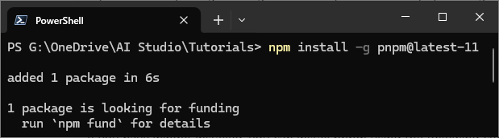

# pnpm (Optional)

[pnpm](https://pnpm.io/installation) 是一个快速且节省磁盘空间的现代 Node.js 包管理器

## 官方网站

  <iframe src="https://pnpm.io/installation" loading="lazy">
  </iframe>

## 安装步骤

1. 确保 npm 安装成功后，打开终端输入命令 `npm install -g pnpm@latest-11`
2. 如下图，安装结束

## 验证

1. `Win + R` 输入 `wt` 打开 Windows Terminal
2. 终端输入命令 `pnpm --version`
3. 如下图，正常显示版本号则安装成功

