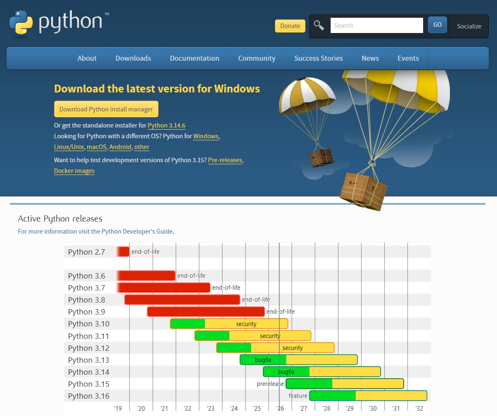
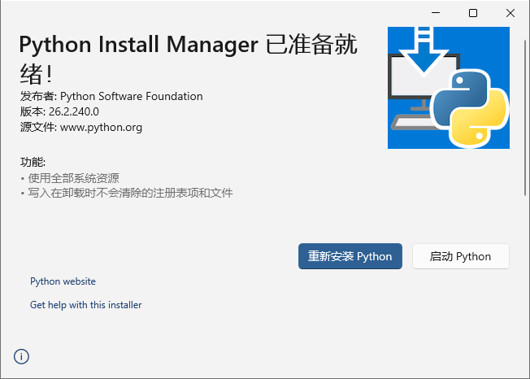
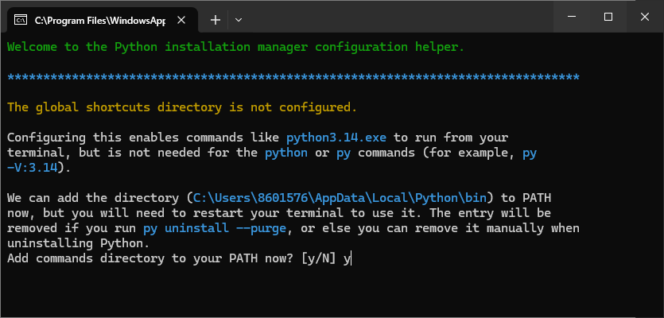
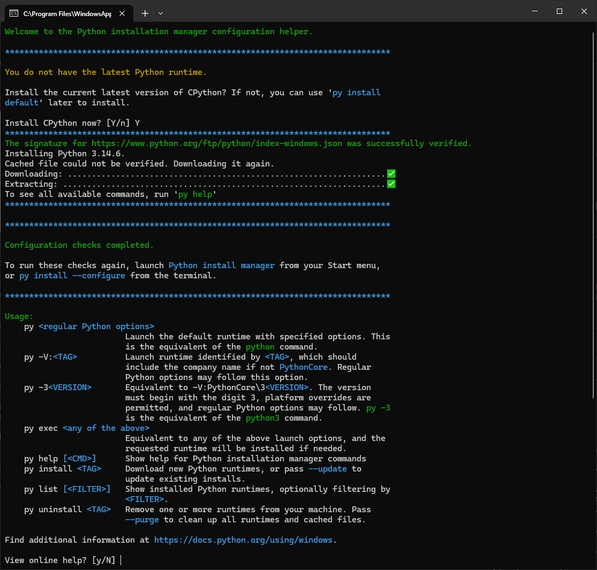
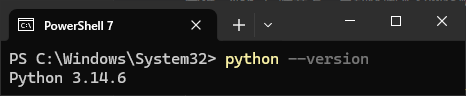

# Python

[Python](https://www.python.org/downloads/) 是一种由 Guido van Rossum 于 1991 年发布的高级、解释型、跨平台编程语言。它以语法简洁、接近自然语言（使用缩进代替大括号）和极高的代码可读性著称，大幅降低了编程门槛。凭借庞大标准库和极其丰富的第三方生态，Python 在人工智能、数据分析、Web 后端开发、自动化脚本及网络爬虫等众多领域占据着统治地位，是目前全球最受欢迎的通用编程语言之一。

## 官方网站

## 安装步骤

1. 使用附件 `python-manager-<version>.msix` 安装

2. 弹出终端界面，按照引导 **配置环境变量** 和 **安装 Python 运行时**

## 验证

1. `Win + R` 输入 `wt` 打开 Windows Terminal
2. 终端输入命令 `python --version`
3. 如下图，正常显示版本号则安装成功

